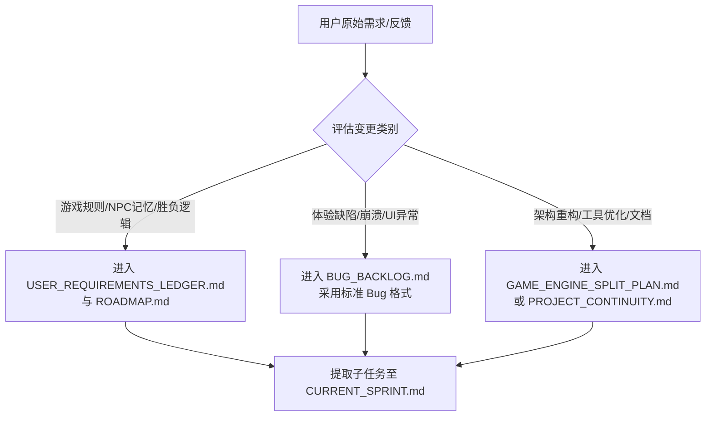

# Project Channels (项目频道与工作流规范)

更新日期：2026-06-04

## 目的

把长期项目拆成多个工作频道，减少聊天上下文污染。每个频道只讨论自己范围内的问题，并通过项目文件同步事实。

## Codex Threads

Codex `create_thread` 的项目目标使用工作区路径：

```text
G:\Trae-Project\werewolf-ville
```

已建立并固定的项目线程：

| 频道 | 线程标题 | Thread ID | 用途 |
| --- | --- | --- | --- |
| 项目工具与结构 | Werewolf Ville｜项目结构与治理 | `019e8322-7e35-71b1-aba5-0148fb57347d` | Git、文档、MCP、worker、启动脚本、模块拆分、项目治理 |
| 玩法修改 | Werewolf Ville｜玩法设计 | `019e92f1-c30c-7e42-a14c-b695433729bf` | 玩法规则、NPC 智能、日夜流程、银器、小刀、投票、胜负条件 |
| Bug 修改 | Werewolf Ville｜Bug 修复 | `019e92f1-e1b0-7153-9b92-859a70f450d4` | 具体 bug 的复现、定位、修复、测试、关闭 |

注意：此前用显式 model override 创建的两个线程进入过 `systemError`，已经归档。后续创建项目线程时不要强行传模型名，优先使用默认模型配置。

---

## 频道一：玩法修改 (Gameplay Design)

**用途**：讨论和设计游戏规则、剧情推进、NPC 智能、胜负条件、银器、小刀、夜晚、投票等。

*   **入口文件**：
    *   [PROJECT_CONTINUITY.md](file:///G:/Trae-Project/werewolf-ville/PROJECT_CONTINUITY.md) (长期核心玩法事实)
    *   [ROADMAP.md](file:///G:/Trae-Project/werewolf-ville/ROADMAP.md) (阶段性设计)
    *   `docs/superpowers/specs/` (具体玩法专项设计)
*   **产出**：
    *   新规则说明、接受标准、测试计划。
    *   进入 [CURRENT_SPRINT.md](file:///G:/Trae-Project/werewolf-ville/CURRENT_SPRINT.md) 的开发任务。
*   **不处理**：
    *   临时 UI bug、MCP/工具故障、服务器启动与性能问题。

## 频道二：Bug 修改 (Bug Fixing)

**用途**：复现、定位、修复、验证具体 bug。

*   **入口文件**：
    *   [BUG_BACKLOG.md](file:///G:/Trae-Project/werewolf-ville/BUG_BACKLOG.md) (Bug 统一追踪库)
    *   [CURRENT_SPRINT.md](file:///G:/Trae-Project/werewolf-ville/CURRENT_SPRINT.md) (当前正在修复的缺陷)
    *   相关测试文件。
*   **产出**：
    *   根因说明、最小修复、测试结果、Git 提交。
*   **限制规则**：
    *   非平凡 bug 修复必须优先实际调用 DeepSeek 和/或 Antigravity。默认二者可用，不要因为“可能不可用”而跳过；如果没有调用，必须说明具体原因。
    *   不能顺手加玩法。
    *   不能大范围重构，除非 bug 根因就是结构问题。
    *   每个 bug 必须有验证方式。

## 频道三：项目工具与结构 (Project Tools/Structure)

**用途**：处理 Git、文档、MCP、worker、启动脚本、测试框架、模块拆分、运行态分离、长期维护流程。

*   **入口文件**：
    *   [AGENTS.md](file:///G:/Trae-Project/werewolf-ville/AGENTS.md) (协作与SOP)
    *   [GAME_ENGINE_SPLIT_PLAN.md](file:///G:/Trae-Project/werewolf-ville/GAME_ENGINE_SPLIT_PLAN.md) (状态机拆分计划)
    *   [PROJECT_CONTINUITY.md](file:///G:/Trae-Project/werewolf-ville/PROJECT_CONTINUITY.md) (工程风险与架构)
*   **产出**：
    *   工程结构改进、流程文档、worker 使用策略、可回滚的 Git 提交。
*   **限制规则**：
    *   结构调整要优先保护现有功能。
    *   大文件拆分必须按切片提交。
    *   每次拆分后跑测试。

---

## 1. Backlog 准入与进入规则

为保证各频道的任务能够规范地沉淀和流转，各模块任务进入 Backlog 时必须遵守以下路径：



### 1.1 玩法需求准入
*   **记录位置**：[USER_REQUIREMENTS_LEDGER.md](file:///G:/Trae-Project/werewolf-ville/USER_REQUIREMENTS_LEDGER.md)。
*   **格式要求**：提炼为可执行的具体规则（如“普通交谈每天每个 NPC 一次”），避免直接复制口头聊天。对于大玩法变更，必须在 `docs/superpowers/plans/` 撰写技术设计方案。

### 1.2 Bug 缺陷准入
*   **记录位置**：[BUG_BACKLOG.md](file:///G:/Trae-Project/werewolf-ville/BUG_BACKLOG.md)。
*   **格式要求**：必须填报标准格式，包括标题、严重度、关联需求、复现步骤、实际表现、期望表现、疑似影响文件、验证方式、回归测试、关闭门禁、状态。详见 `BUG_BACKLOG.md` 模板。

### 1.3 项目工具与结构准入
*   **记录位置**：[GAME_ENGINE_SPLIT_PLAN.md](file:///G:/Trae-Project/werewolf-ville/GAME_ENGINE_SPLIT_PLAN.md) 或 [PROJECT_CONTINUITY.md](file:///G:/Trae-Project/werewolf-ville/PROJECT_CONTINUITY.md)。
*   **格式要求**：拆分工作以“Slice (切片)”为单位，清晰描述抽取范围、目标文件、受影响的测试用例及回滚步骤。

---

## 2. 跨频道同步机制 (Sync Rules)

由于多频道通过不同的文档承载，必须维持**单一事实来源**（SSOT，见 `PROJECT_CONTINUITY.md §12`）。不允许同一事实在多文件中重复。

1.  **文件事实驱动**：所有频道的进度变动均通过修改对应单一文件来体现。严禁在聊天记录里”宣布完成”而不更新文件状态。
2.  **REQ 编号追溯**：bug 记录必须填写「关联需求」（REQ-XXX）字段；commit 信息末尾可加 `(refs REQ-XXX)` 或 `(closes REQ-XXX)`；测试用例头部标注 `# covers REQ-XXX`。
3.  **阶段进度同步**：
    *   开发中：非平凡任务在 `.planning/任务名/progress.md` 中维护焦点和已完成项。
    *   完成时：commit 中**同时更新**相关 Backlog 文件状态（如 `Open → Closed`）。
4.  **提交隔离**：
    *   一次 Git 提交只能对应一个频道的工作。
    *   提交前缀规范：`feat(gameplay)`、`fix(ui)`、`refactor(engine)`、`test(module)`。
5.  **规则变更同步**：
    *   修改协作规则时，同步在 `DECISIONS.md` 添加决策记录，并在 `CURRENT_SPRINT.md` 中标明。

---

## 3. 冲突仲裁机制 (Arbitration Rules)

在多频道开发中，经常会出现“重构拆分文件”与“修 bug/改玩法”在物理或逻辑上发生冲突的情况。仲裁规则如下：

### 3.1 优先级排序 (Priority Hierarchy)
在代码改动冲突时，执行以下优先级：
$$\text{项目工具与结构 (底层重构)} > \text{Bug 修复 (稳定性)} > \text{玩法修改 (新需求)}$$

*   **解释**：当 `game_engine.py` 正在执行切片拆分时，玩法修改频道的新功能开发必须**挂起**，直至当前切片拆分完成、测试全绿并提交。严禁在不稳定或正在拆分的代码结构上强行叠加新玩法。

### 3.2 物理合并冲突仲裁
当发生 Git 合并冲突时：
1.  **回滚至安全提交**。
2.  优先合入结构重构或工具优化分支（保证代码组织结构最新）。
3.  在此基础上，重新在新结构中实现 bug 修复或玩法变更。
4.  **原则**：代码结构一旦改变，所有的 bug 修复和玩法实现必须无条件适配新结构，不能以“为了修 bug”为由阻碍重构。

### 3.3 逻辑冲突（玩法与重构）仲裁
如果一个 bug 的修复方案与当前进行的结构拆分发生逻辑冲突：
*   **步骤一：静态与动态验证**。首先以 tests 结果和 `python -m py_compile` 为准。任何导致测试失败的方案均判定为无效。
*   **步骤二：核对需求账本**。查询 `USER_REQUIREMENTS_LEDGER.md` 确认是否有明确的用户要求。
*   **步骤三：用户介入仲裁**。如果冲突属于“在两套合理的实现方案中做选择”，或者属于需求本身的歧义，主 Agent 应整理成多选题直接提交给用户，由用户决策，严禁擅自猜测和盲目修改。
