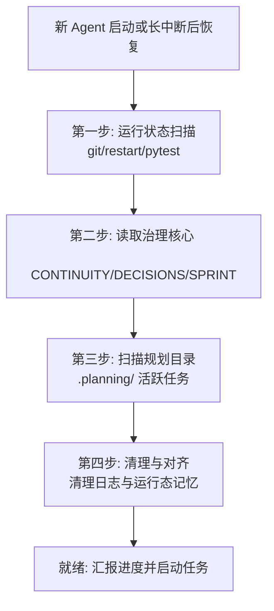

# Werewolf Ville 项目连续性文档

更新日期：2026-06-04（本节新增 12-13）

## 1. 文档目的

这个项目已经从一次原型修改变成了长期迭代项目。以后继续开发时，优先读这份文档，再读代码和专项设计文档，不再依赖长聊天记录。

这份文档只记录项目精华：产品方向、核心规则、现有系统、已做过的重要改进、当前风险、后续工作方式。临时 bug、调试过程、模型报错和一次性操作不应该继续堆在聊天里，而应该沉淀到任务清单或 bug 清单。

## 2. 信息来源与可信度

项目事实来自这些地方，优先级如下：

1. 当前代码事实：`game_engine.py`、`agent.py`、`llm.py`、`world_config.py`、`night_hunt.py`、`simulation_events.py`、`ui/app.py`、`ui/templates/index.html`、`config.yaml`。
2. 测试事实：`tests/` 下的 pytest，尤其是 `test_engine_foundation.py`、`test_world_config.py`、`test_vote_flow.py`、`test_ui_bubble_layout.py`、`test_llm_priority.py`、`test_prompt_boundaries.py`。
3. 项目协作规则：`AGENTS.md` 和 `C:\Users\XD\.codex\RTK.md`。
4. 已有设计文档：`docs/superpowers/specs/` 与 `docs/superpowers/plans/`。
5. 用户在聊天中提出的设计要求。聊天记录只能作为补充来源，必须尽快沉淀到本文档、任务清单或专项设计文档。

注意：根目录旧文档 `REQUIREMENTS.md`、`TASK.md`、`TECHNICAL_REPORT.md` 目前存在中文编码损坏，不能再作为可靠唯一来源。它们只能作为历史线索，后续应逐步用新的 UTF-8 文档替代。

DeepSeek 和 Antigravity worker 产出的审计文档只能作为辅助审阅材料，不能自动视为真相。主 agent 必须核对代码、测试和实际浏览器表现。

## 3. 项目目标

Werewolf Ville 的目标不是单纯复刻狼人杀，也不是纯粹看 NPC 自由活动，而是一个侦探探索 + 狼人杀推理的小镇模拟游戏。

玩家控制警长克罗，在一个持续运作的小镇里调查命案。NPC 要像有自己生活和秘密的人一样行动：白天工作、移动、观察、交谈、保留记忆、表达怀疑；狼人要隐藏身份、互相掩护、夜晚杀人；好人要协助调查、发现线索、参与讨论和投票。

当前阶段仍是调试视角，可以暴露模型、狼人身份、NPC 思考和行动，方便检查模拟质量。以后进入正式玩家视角时，这些导演信息要逐步关闭。

## 4. 核心玩法设计

### 4.1 角色与阵营

- 一局以 8 个参与者为主：警长克罗 + 7 个 NPC。
- 每局从 7 个 NPC 中随机选出 2 个狼人，克罗永远不能是狼人。
- 两个狼人知道彼此身份，可以在白天互相掩护。
- 好人中有 1 个隐藏银质小刀持有者，不能是克罗，不能是狼人。
- 有 1 个女性 NPC 可能持有银质饰品，可用于制作银子弹。持有人每局可以变化，也可能是狼人。
- 狼人身份、银质小刀、银饰持有人都属于黑盒信息，除非角色本人知道、亲眼观察到，或者通过公开讨论获得，否则不应该出现在普通 NPC prompt 中。

### 4.2 白天流程

1. 早晨发现尸体。
2. 所有人围到尸体附近。
3. 克罗用多段气泡介绍案情：自己是警长、昨夜有人遇害、尸体有野兽抓咬痕、死因仍需调查、他会逐一问话、右侧灯泡代表 NPC 有线索或重要想法。
4. 克罗询问所有人昨晚在做什么。
5. 第一轮 NPC 只回答自己的昨夜行踪和情绪，不主动踩其他 NPC，不提前分析狼人或伤口。
6. 第一轮结束后，克罗说大家先去做自己的事，黄昏再集合讨论。
7. NPC 再逐个说明自己要去哪里、为什么离开，然后真正散开行动。
8. 白天自由行动阶段，NPC 根据职业、记忆、观察和目标做事：工作、调查、找人交谈、找克罗汇报线索、避开危险对象等。

### 4.3 侦探交谈

- 右侧 NPC 卡片提供交谈入口。
- 普通交谈：克罗走到 NPC 身边，克罗先用固定但自然的问法开口，核心是询问对方昨夜行踪、是否能自证、怀疑谁和理由。NPC 再回答。
- 每天克罗可以和每个可交谈 NPC 普通交谈一次。
- 深度挖掘：普通交谈后出现，玩家输入具体问题，克罗走到 NPC 面前先说，NPC 再答。
- 深度挖掘当前规则是每天 3 次。
- 当克罗正在和某个 NPC 对话时，其他 NPC 不应该插入或围过来打扰。
- 与克罗对话应该拥有高优先级，不能被 NPC 后台思考或普通行动队列长时间阻塞。

### 4.4 黄昏讨论与投票

黄昏不是直接投票。正确流程是：

1. 玩家点击“结束本回合开始讨论”。
2. 所有存活、未被监禁的参与者集合。
3. 先进入黄昏讨论，每个 NPC 基于自己的记忆、线索、怀疑和阵营目标独立发言。
4. 玩家控制克罗打字发言。
5. 全部发言结束后才进入投票。
6. NPC 独立投票，也可以弃票；他们可以不听克罗号召。
7. 所有 NPC 投完后，显示投票结果 UI：谁投了谁、每个人得几票、谁弃票。
8. 玩家再决定克罗最终投谁或如何处理平票。
9. 被选中的人发表遗言。
10. 克罗把此人押送到警长区域的牢房，该角色等价出局：不能移动、不能交谈、不能投票、不能夜间行动。
11. 克罗发表入夜提醒后进入夜晚。

### 4.5 夜晚与狼人

- 狼人每天晚上必须杀 1 人；两个狼人都活着时，全队每晚总共也只能杀 1 人。
- 狼人不能在最后阶段前优先杀克罗。
- 杀人应经过地图移动、目标选择、风险评估和线索生成。
- 如果杀人困难、路线远或容易被看到，留下的线索应该更多。
- 夜晚结束后早晨发现新尸体，再进入下一天早晨流程。

### 4.6 银器与反制

- 第一天大家只知道尸体有野兽抓咬痕，不应直接确认狼人。
- 第一天白天应有 NPC 去图书馆/书架查询，发现“凶手可能是狼人”的可能性。
- 第一天黄昏讨论前后，才应把狼人可能性纳入公开讨论。
- 第二天如果再次出现野兽抓咬尸体，克罗确认凶手是狼人。
- 第二天起，克罗要准备银子弹资源：
  - 去五金店获取制作工具。
  - 找女性 NPC 获取银质饰品。
- 克罗每天只能完成一个银器重大任务。
- 工具或银饰提供者如果是狼人，可以拒绝、拖延、谎称丢失或提前转移物品。
- 狼人也可以主动干扰工具或银饰，但必须留下可追踪线索。
- 第四天克罗最多制作并使用一颗银子弹，只能击杀一个目标。
- 隐藏银质小刀持有者可以在夜晚使用一次小刀，杀中好人则好人死，杀中狼人则狼人死。

## 5. 当前代码已具备的系统

以下是从代码和测试中确认存在的系统，不代表体验完全稳定：

- Flask + Flask-SocketIO 后端，入口是 `main.py`，UI 服务在 `ui/app.py`。
- Phaser 前端集中在 `ui/templates/index.html`。
- `game_engine.py` 是主状态机，负责白天、黄昏、夜晚、NPC 调度、寻路、投票、监禁、银器、线索、尸体、状态序列化。
- `agent.py` 负责 NPC 的人格、记忆、认知、对话、行动决策 prompt、JSON 行动解析。
- `llm.py` 负责 OpenAI 兼容接口、供应商配置、运行时 API key/base URL/model、并发与优先级。
- `world_config.py` 定义活跃角色、中文显示名、地点、警长区域、初始尸体、地图语义。
- `night_hunt.py` 负责夜间追杀候选评分和线索生成。
- `simulation_events.py` 负责尸体和线索数据结构。
- 已有 8 人局、2 狼随机、狼人互知、银饰、小刀、任务、右侧灯泡、投票历史、规则弹窗、中文名、气泡布局、模型供应商检测等实现或测试痕迹。

## 6. 已做过的重要改进

- 从 6 人/单狼扩展到 8 人/双狼方向。
- 狼人身份改为每局随机，不写死在角色背景里。
- 角色职业逐步与地图地点绑定：咖啡馆、五金店、酒馆、大学、市场/药房、公园等。
- 克罗从侦探表述转向警长表述，警长区域包含办公室和两间牢房。
- 增加前置尸体、尸体发现、晨会集合、尸体安葬、夜晚杀人后次日发现尸体。
- 增加 NPC 自主行动：思考/计划/行动，正常生活、调查、找人交谈或找克罗。
- 增加右侧 NPC 卡片：交谈、深挖、详细、灯泡、模型状态等。
- 增加 API key/provider/model 的开始页配置和检测。
- 增加投票、监禁、银器、小刀、任务列表、规则弹窗、投票历史等玩法系统。
- 多次修复或尝试修复：气泡遮挡、气泡边缘挤压、克罗蓝色行动气泡、NPC 名字和模型名层级、对象碰撞、角色站位、日志清理、模型超时保底、对话历史显示、中文名替换、林梅与克劳斯分房间等。

## 7. 当前最重要的工程风险

### 7.1 版本控制已建立，但仍需严格使用

项目已经建立 Git 仓库，并创建了初始基线提交。之前曾出现 `game_engine.py` 被清空后从临时快照恢复的情况，因此版本控制不再是“待建立事项”，而是必须持续执行的安全底座。

后续任何非平凡改动都必须先确认 `git status`，再按频道和任务边界提交。大文件拆分、玩法修改、Bug 修复不能混在同一个提交里。worker 可以参与实际修改，但主 agent 必须在提交前审查 diff、测试结果和文档同步状态。

### 7.2 根目录旧文档编码损坏

`REQUIREMENTS.md`、`TASK.md`、`TECHNICAL_REPORT.md` 现在有大量乱码，后续不能继续把新事实写进这些文件，除非先修复编码。

### 7.3 `game_engine.py` 过大

`game_engine.py` 已经承担太多职责：状态机、路径、NPC 行动、投票、银器、监禁、UI 状态、日志、对话。后续应逐步拆出：

- `dusk_vote.py`
- `tasks.py`
- `silver_objectives.py`
- `conversation_flow.py`
- `npc_scheduler.py`
- `bubble_state.py`

### 7.4 运行态 persona 文件容易污染

`personas/*/memory.md`、`cognition.md`、`agent.md`、`scratch.json`、`memory_index.json` 会被游戏运行写入。它们既像资源，又像运行数据，容易被 worker 误改或跨局污染。

后续应区分：

- 静态人格模板：可版本控制。
- 单局运行记忆：新游戏前清空，或放入独立 runtime 目录。

### 7.5 UI bug 与产品设计混在一起

气泡、按钮、站位、日志、模型超时、NPC 卡住这些 bug 占用了大量聊天上下文，导致核心目标容易丢。以后必须把 bug 流和产品路线分开管理。

## 8. 推荐的长期工作流

### 8.1 文档分层

建议以后固定使用这些文件：

- `PROJECT_CONTINUITY.md`：项目总入口，记录产品方向、核心规则、当前架构、长期风险。
- `ROADMAP.md`：只记录产品阶段和设计取舍，不记录零碎 bug。
- `BUG_BACKLOG.md`：只记录 bug，包含复现、期望、根因、修复状态、验证方式。
- `TASK.md` 或新的 `CURRENT_SPRINT.md`：只记录当前一次工作要完成的事情。
- `findings.md`：复杂调查时记录事实，不写猜测。
- `progress.md`：长任务的阶段进度，避免断线后不知道做到哪。

### 8.2 每个 bug 的记录格式

每个 bug 不要只写“又坏了”，要写成：

```text
标题：
严重度：
复现步骤：
实际表现：
期望表现：
疑似影响文件：
根因：
修复方案：
验证命令：
浏览器验证结果：
状态：
```

### 8.3 每个功能的记录格式

每个功能不要直接开改，先写：

```text
目标：
用户体验：
规则边界：
数据状态：
接口/API：
UI 表现：
测试用例：
验收标准：
```

### 8.4 worker 使用规则

非平凡工作开始前必须先判断是否能委派：

- DeepSeek：适合后端规则、状态机、prompt 契约、测试、复杂 bug 根因分析。
- Antigravity：适合前端 UI、Socket/浏览器交互、后端拆分、文档整理。
- 主 agent：负责任务拆分、审阅 worker 改动、整合、跑测试、浏览器验证。

worker 不能替代审阅。尤其是当 worker 修改 `personas/`、运行态文件、缓存文件或超出任务范围时，必须拦截并复核。

### 8.5 UI 验证规则

涉及前端 UI 的 bug，不能只跑 pytest。必须：

1. 确保 5000 端口跑的是最新版本。
2. 刷新浏览器。
3. 自己用内置浏览器或浏览器工具跑一遍。
4. 截图确认：气泡、按钮、列表、任务区、投票面板、NPC 层级、地图位置。

### 8.6 服务器规则

用户希望只保留 `restart.bat` 作为启动/重启入口。后续改代码后，应杀旧进程并让 `http://127.0.0.1:5000/` 跑最新版本。

## 9. 下一步应优先处理的未完成事项

这些是当前上下文里明确还没收口的体验问题：

1. 删除右下角多余日志块。右下角应主要显示警长任务，不应出现未要求的杂项日志区域。
2. 重做投票环节顺序：黄昏先集合讨论，NPC 逐个发言，然后玩家/克罗打字发言，全部发言完再进入投票。
3. 检查 `personas/` 是否被 worker 或运行态污染；新游戏前必须清空单局记忆，避免脏数据跨局。
4. 修复或复核克罗行动时不应出现蓝色思考/行动气泡。
5. 复核气泡系统：不能穿透右侧 UI，不能在边缘被挤成长条，蓝色气泡要计时消失，多个 NPC 近距离时不能重叠。
6. 复核 NPC 对话优先级：克罗找 NPC 时，对方必须优先回复；其他 NPC 不插入。
7. 复核林梅和克劳斯在大学内分别使用图书馆/教室锚点，不应继续挤在同一房间。
8. 复核 NPC 名字、地点、详细记录、日志中残留英文和 `[object Object]`。
9. 复核模型超时保底：只有真正超时才打“超时保底”日志；正常回复不打印噪声。
10. 复核 NPC 不能长期原地只思考；思考应导向行动，若 stay 也要明确显示行动理由。

## 10. 后续迭代原则

先稳住体验闭环，再扩玩法复杂度。

短期目标：

- 白天第一天完整跑通：开场、NPC 发言、散场、自由行动、交谈、任务完成、黄昏讨论、投票、关押、入夜。
- NPC 对话和行动不阻塞玩家体验。
- UI 气泡、右侧列表、任务区、日志不再反复回退。

中期目标：

- 夜晚双狼物理杀人稳定。
- 第一天图书馆发现狼人可能性，第二天确认狼人。
- 银器任务和小刀身份形成可推理线索。
- 投票、监禁、死亡、胜负条件形成闭环。

长期目标：

- 关闭导演信息，转为正式玩家视角。
- 把 `game_engine.py` 拆分成可测试模块。
- 把运行态 persona 与静态角色模板分离。
- 建立稳定版本控制、回归测试和浏览器验收流程。

## 11. 回归套件与 Bug 关闭门禁

### 11.1 回归套件组成

回归测试套件由以下层次构成，从快到慢：

| 层次 | 命令 | 覆盖范围 | 触发时机 |
|------|------|---------|---------|
| L0 编译门禁 | `python -m py_compile agent.py game_engine.py llm.py ui/app.py` 及新增模块 | 所有 Python 文件无语法错误 | 每次提交前 |
| L1 单元测试 | `pytest -q tests/test_engine_foundation.py` | 引擎核心函数、路径、碰撞 | 每次切片提交 |
| L2 模块测试 | `pytest -q tests/test_vote_flow.py tests/test_ui_bubble_layout.py tests/test_llm_priority.py` | 投票、气泡、对话优先级 | 涉及对应模块时 |
| L3 全量回归 | `pytest tests/ -x --tb=short -q --timeout=120` | 所有已有测试 | 大范围修改或合并前 |
| L4 浏览器验收 | 手动（IAB 截图） | 气泡、UI 布局、交互流程 | 涉及前端改动时 |

### 11.2 Bug 关闭门禁

一个 bug 从 `Fixed` 转为 `Closed` 必须满足以下全部条件（在 BUG_BACKLOG.md 的「关闭门禁」列表中逐项勾选）：

1. **编译通过**：受影响的全部 Python 文件通过 `py_compile`。
2. **回归测试通过**：新增或依赖的回归测试（见 BUG 记录的「回归测试」字段）全部 Green。
3. **根因确认**：BUG 记录中的「根因」字段已填写，不能为空。
4. **浏览器验证**（仅 UI 相关 bug）：截图确认修复有效。
5. **关联需求追溯**：BUG 中的「关联需求」字段已填写对应的 REQ 编号。
6. **验收状态更新**：BUG 记录状态从 `Fixed` 更新为 `Closed`，并记录相关提交。

如果 bug 属于 **External**（外部模型服务、第三方库），验收状态可以标记为 `Deferred`，但必须在记录中说明缓解措施。

### 11.3 回归测试新增规则

修改代码时，如果改变了已有行为或修复了 bug，**必须**：

1. **新增测试覆盖**：在受影响模块对应的测试文件中新增至少一个测试用例，验证修复后的行为。
2. **标记覆盖的 REQ**：新增测试的 docstring 或头部注释标注 `# covers REQ-XXX`。
3. **不可删除旧测试**：除非旧测试逻辑与修改后的正确行为明确冲突（需在注释中写明原因）。

## 12. 单一事实来源与文档去重原则

### 12.1 文件职责矩阵

以下是每个根目录治理文件的唯一职责。**同一个事实只写在一个文件中，其他文件引用而非重复**：

| 文件 | 唯一职责 | 不应包含 |
|------|---------|---------|
| `PROJECT_CONTINUITY.md`（本文档） | 产品方向、核心玩法规则、系统架构、工程风险、工作流规范 | bug 列表、具体任务、逐条需求细节 |
| `USER_REQUIREMENTS_LEDGER.md` | 用户提出的所有可执行要求，含 REQ 编号体系 | bug 描述、代码结构分析 |
| `BUG_BACKLOG.md` | 全部 bug 记录，含复现、根因、回归测试、关闭门禁 | 产品设计讨论、长期路线 |
| `ROADMAP.md` | 阶段路线和设计取舍，不含零碎 bug | bug 清单、需求细节 |
| `CURRENT_SPRINT.md` | 当前一次 sprint 的任务清单和验证要求 | 长期方向、设计讨论 |
| `AGENTS.md` | worker 协作规则、能力矩阵、审查流程、任务派发模板 | 产品玩法、bug 列表 |
| `GAME_ENGINE_SPLIT_PLAN.md` | 游戏引擎拆分执行计划（切片顺序、验证、回滚） | 产品玩法、协作规则 |

### 12.2 文档引用规则

- 当需要引用另一个文件中的事实时，使用 `见 xxx.md §N` 格式，不复制内容。
- 例如：BUG 的「关联需求」引用 `USER_REQUIREMENTS_LEDGER.md` 中的 REQ 编号，而非重复需求全文。
- 例如：回归测试规则见本文档 §11，不复制到其他文件。

### 12.3 `docs/` 目录文档定位

`docs/` 下的文档（`docs/deepseek-*.md`、`docs/antigravity-*.md` 等）是 worker 产出的辅助审阅材料：

- 它们是某一时间点的分析快照，**不是**最新事实来源。
- 主 agent 使用其中的建议后，应将稳定结论吸收到根目录治理文件。
- 如果 `docs/` 文档与根目录文件冲突，以根目录文件为准。
- 旧版 `docs/antigravity-project-channels-plan.md` 中的频道定义已吸收到 `PROJECT_CHANNELS.md`，该文件不再作为活跃引用源。

### 12.4 旧文档处理

- `REQUIREMENTS.md`、`TASK.md`、`TECHNICAL_REPORT.md`：编码损坏，不再更新。历史线索如需恢复则修复编码，否则逐步废弃。
- `IMPLEMENTATION_PLAN.md`、`TECHNICAL_REVIEW.md`：已完成历史使命，不再作为活跃开发参考。

## 13. 长期项目上下文恢复与初始化规范 (Context Recovery SOP)

当项目开发中断（如跨天、跨会话重置、或者更换主 Agent）后，新进入的 Agent 必须严格执行以下四步以恢复上下文，严禁在未拉齐信息的情况下盲目开改。



### 13.1 第一步：物理环境与状态检查
1.  **代码状态扫描**：运行 `rtk git status` 和 `rtk git log -n 5`，确认当前处于哪条分支，最近几次提交修改了什么，是否有未提交的修改。
2.  **基线编译检查**：确保当前代码无语法错误：
    ```powershell
    rtk python -m py_compile agent.py game_engine.py llm.py ui/app.py
    ```
3.  **运行回归测试**：运行 pytest 评估基线健康度：
    ```powershell
    rtk pytest -q tests/test_engine_foundation.py
    ```

### 13.2 第二步：读取治理核心文档
按照以下固定顺序阅读核心文档，重塑全局认知：
1.  **[PROJECT_CONTINUITY.md](file:///G:/Trae-Project/werewolf-ville/PROJECT_CONTINUITY.md)**（当前文件）：重新理解项目的核心玩法、系统架构和当前重点工程风险。
2.  **[DECISIONS.md](file:///G:/Trae-Project/werewolf-ville/DECISIONS.md)**：查看最近的决策与规则修改，确保不违反新立下的约定。
3.  **[CURRENT_SPRINT.md](file:///G:/Trae-Project/werewolf-ville/CURRENT_SPRINT.md)**：锁定当前 Sprint 的核心目标、所属频道以及当前要做的事情。

### 13.3 第三步：扫描活跃任务规划
1.  进入 [.planning/](file:///G:/Trae-Project/werewolf-ville/.planning/) 目录，查看当前有哪些处于激活状态（进行中）的子任务目录。
2.  阅读对应任务目录下的 `task_plan.md`（理解方案）与 `progress.md`（查看当前卡点、最近一次测试验证结果和下一步 TODO）。
3.  如果发现没有活跃的任务目录，但在 `CURRENT_SPRINT.md` 中有进行中的任务，应立即按规范建立新的规划目录。

### 13.4 第四步：环境清理与启动对齐
1.  **日志与进程清理**：如果有旧的服务器进程残留，运行 `restart.bat` 重启，确保占用 5000 端口的是最新代码。同时清理体积过大的 `server.stdout.log` / `server.stderr.log`。
2.  **隔离运行态记忆**：检查 `personas/` 目录下是否有单局游戏运行留下来的脏 memory 文件。如果需要开启新一轮游戏测试，必须确保运行态记忆已初始化，不被脏数据污染。
3.  **与用户握手**：在前述步骤完成后，向用户输出一个精简的“上下文恢复报告”，说明：
    *   目前处于哪个任务切片。
    *   当前物理编译和测试状态（Pass/Fail）。
    *   下一步的计划动作。
    *   如有疑虑，提示用户决策。

## 14. 第一阶段引擎结构收口结果（2026-06-04）

第一阶段按低风险职责完成拆分：

- `engine_navigation.py`：地图、碰撞、场景查询、BFS 寻路工具。
- `engine_tasks.py`：警长每日任务状态构建。
- `engine_bubbles.py`：引擎侧气泡计时、过期清理、思考摘要。
- `engine_dusk.py`：黄昏、投票、投票历史、拘留与监狱。

主类 `WerewolfGameEngine` 通过 mixin 保持原有方法入口，外部 API 不变。结构阶段不修改玩法规则或 UI Bug。

后续银器、对话、NPC 调度、晨会属于高风险职责，只能在独立任务中拆分，并同时运行对应回归测试。下一阶段默认转入 Bug 修复线程，以 `BUG_BACKLOG.md` 为执行入口。
