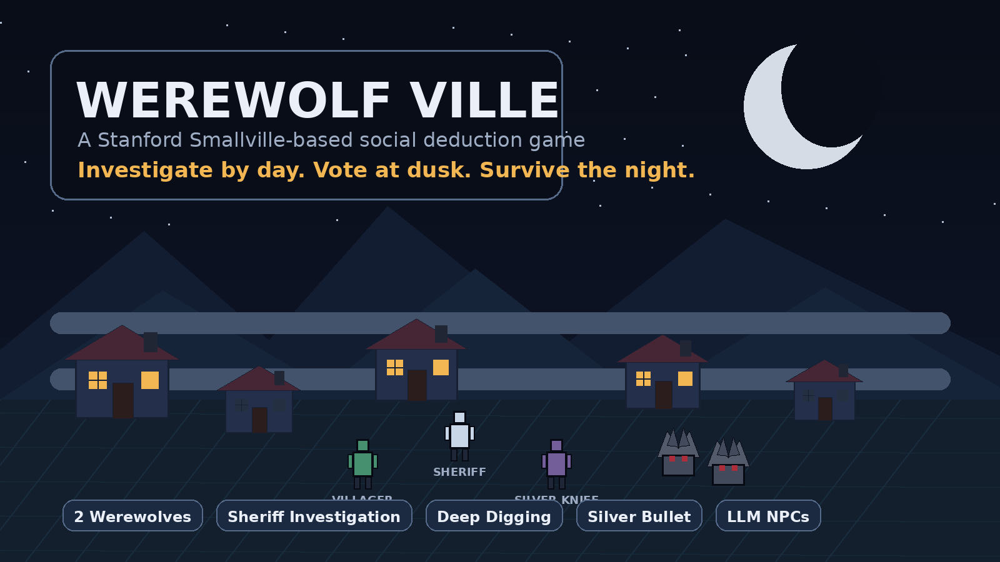
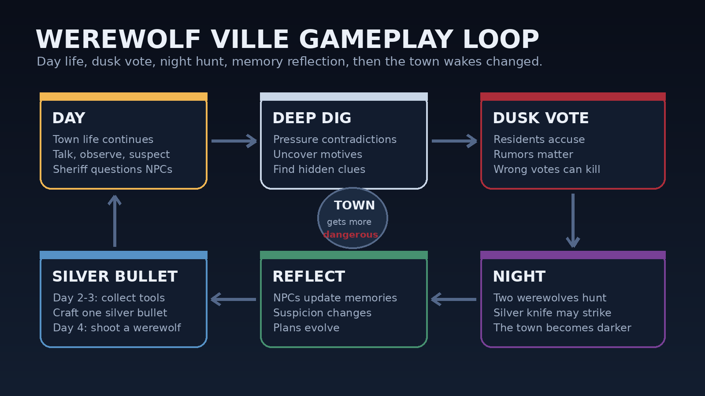

# Werewolf Ville

[English](README.md) | [简体中文](README.zh-CN.md)



Werewolf Ville is a browser-based social deduction game built from the Stanford Smallville simulation resources. It transforms a generative-agent town simulation into a playable Werewolf-style mystery game: a living town where residents talk, observe, suspect, remember, reflect, and make decisions through large language models.

The player takes the role of the sheriff. During the day, the sheriff investigates the town, talks to residents, collects clues, and tries to understand who can be trusted. At dusk, the town votes. At night, the werewolves move.

## Gameplay



The town contains two hidden werewolves, a sheriff controlled by the player, ordinary villagers, and one special villager who owns a silver knife. Every day begins with normal town life. Residents move around, talk to each other, exchange information, develop suspicion, spread rumors, and search for signs of the werewolves.

The sheriff can question NPCs directly. In addition to ordinary conversations, the sheriff has a deep-digging skill that allows more focused interrogation. Deep digging is used to pressure suspicious residents, follow contradictions, uncover hidden motives, and extract clues that may not appear in casual conversation.

At dusk, the town enters a voting phase. Residents vote based on what they saw, heard, suspected, misunderstood, or were persuaded to believe during the day. A vote may remove a real threat, but it may also punish the wrong person if the town is misled.

At night, the werewolves act and choose a victim. The villager who owns the silver knife may also act at night and kill one person. Every night changes the structure of the town: someone may die, new evidence may appear, relationships may shift, and the next day begins with more fear and suspicion.

The sheriff also has a long-term objective. On the second and third days, the sheriff must collect silver ornaments and bullet-making tools. If successful, the sheriff can craft one silver bullet. On the fourth day, the sheriff can use that bullet to shoot one werewolf.

## AI-Driven NPCs

All town residents are driven by large language models. Their speech, social behavior, suspicion, memory, and decisions are not simple fixed scripts. The system follows the spirit of Stanford Smallville's generative agents: residents observe the world, think about what happened, form plans, take actions, talk to others, and reflect at night.

Each NPC can participate in the social life of the town. They may share information, hide information, misunderstand events, lie, accuse others, defend themselves, or change their attitude as the game progresses. Nightly reflection allows residents to update their memories, goals, suspicions, and future behavior.

## Scale and Expansion

The current demo keeps the number of residents relatively small because every NPC is powered by a large language model. More residents mean more observations, conversations, plans, memories, suspicions, and nightly reflections, which increases the cost and complexity of the simulation.

However, the small cast is only a practical limit for the current demo, not a design limit. The town can be expanded with more residents, denser social relationships, more rumors, more conflicting testimonies, and a more dangerous werewolf threat. As the population grows, the town becomes livelier, harder to read, and more dangerous to investigate.

## Core Features

- Built from Stanford Smallville simulation resources
- LLM-driven NPC speech, social behavior, planning, memory, and reflection
- Two hidden werewolves
- Sheriff-led investigation gameplay
- Deep-digging interrogation skill
- Daytime town life, clue discovery, social interaction, and suspicion
- Dusk voting phase
- Nighttime werewolf attacks
- A special villager with a silver knife
- Silver bullet crafting across Day 2 and Day 3
- Werewolf shooting opportunity on Day 4
- Expandable town population and social complexity

## Project Goal

The goal of Werewolf Ville is to turn a generative-agent town simulation into a playable social deduction game. Instead of solving a fixed mystery script, the player investigates a living town where every resident can speak, remember, suspect, lie, misunderstand, reflect, and change over time.

## How to Run

Werewolf Ville is a Python + Flask browser game. The backend runs the simulation, NPC logic, day-night cycle, voting, memory, and LLM calls. The frontend is served in the browser.

### Requirements

- Python 3.10+
- pip
- A Chat2API-compatible local model service
- Python packages from `requirements.txt`

Install dependencies:

```bash
pip install -r requirements.txt
```

### Configuration

The main configuration file is `config.yaml`. By default, the browser UI runs at:

```text
http://127.0.0.1:5000/
```

The NPC model provider is configured in `config.yaml`:

```yaml
llm:
  api_base: http://127.0.0.1:8000/v1
  api_key: ${CHAT2API_API_KEY}
```

Before running the game, make sure your Chat2API service is already running and the required API key is available as an environment variable.

Windows:

```bat
set CHAT2API_API_KEY=your_api_key_here
```

macOS / Linux:

```bash
export CHAT2API_API_KEY=your_api_key_here
```

### Start the Game

On Windows, you can use:

```bat
restart.bat
```

Or start manually:

```bash
python main.py
```

Then open:

```text
http://127.0.0.1:5000/
```

### Notes

The game currently depends on live LLM responses for NPC behavior, conversation, suspicion, planning, and reflection. If the model service is not running, NPC behavior may be incomplete or delayed.

The current demo keeps the number of residents limited for performance reasons, but the town structure is designed to support more residents and more complex social interactions in future versions.

## Current Status

This project is currently in early demo development. The first goal is to build a stable playable loop: daytime simulation, sheriff investigation, dusk voting, nighttime attacks, NPC reflection, silver bullet progression, and a final confrontation with the werewolves.

## License

License to be decided.
