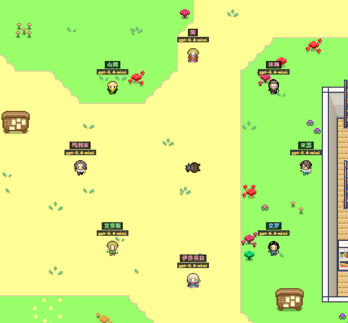

# 狼人小镇
 
[English](README.md) | [简体中文](README.zh-CN.md)


 
狼人小镇是一款基于 Stanford Smallville 资源改造的浏览器端狼人推理游戏。它把原本的生成式智能体小镇模拟，改造成一个可以游玩的狼人杀式推理小镇：小镇居民会通过大模型进行对话、观察、猜疑、记忆、反思和决策。
 
玩家扮演小镇警长。白天，警长需要在小镇中调查，和居民交谈，收集线索，判断谁可信、谁在撒谎。黄昏，小镇开始投票。夜晚，狼人开始行动。
 
## 玩法介绍


 
小镇中有两只隐藏狼人、一名由玩家控制的警长、若干普通村民，以及一名拥有银质小刀的特殊村民。每天白天，小镇居民会继续正常生活。他们会移动、交谈、交换信息、产生怀疑、传播传闻，并寻找狼人的线索。
 
警长可以直接询问 NPC。除了普通对话，警长还拥有“深挖”技能，可以进行更有针对性的追问。深挖用于逼问可疑居民、追查矛盾、挖出隐藏动机，以及获得普通聊天里不一定会出现的线索。
 
黄昏时，小镇进入投票阶段。居民会根据白天看到的、听到的、怀疑的、误解的，或者被别人说服相信的信息进行投票。投票可能除掉真正的威胁，也可能因为误导而冤枉好人。
 
夜晚，狼人开始行动并选择目标杀人。拥有银质小刀的村民也可以在夜晚行动，杀死一个人。每个夜晚都会改变小镇局势：有人可能死亡，新的证据可能出现，人际关系会变化，第二天也会带来更强的恐惧和猜疑。
 
警长还有一条长期目标线。第二天和第三天，警长需要收集银饰品和制造子弹的工具。如果成功，警长可以制造一颗银色子弹。第四天，警长可以用这颗银色子弹射杀一只狼人。
 
## NPC 智能逻辑
 
小镇里所有 NPC 都由大模型驱动。居民的发言、社交、怀疑、记忆和行为决策，不是简单的固定脚本。系统继承了 Stanford Smallville 生成式智能体的思路：居民会观察世界，思考发生了什么，制定计划，执行行动，与其他人交谈，并在夜晚进行反思。
 
每个 NPC 都会参与小镇的社会生活。他们可能分享信息、隐藏信息、误解事件、撒谎、指控别人、为自己辩解，也可能随着游戏推进改变对其他人的态度。每天夜里的反思，会让居民更新自己的记忆、目标、怀疑对象和后续行为倾向。


 
## 规模与扩展
 
当前 demo 的居民数量较少，主要是因为每个 NPC 都由大模型驱动。居民越多，观察、对话、计划、记忆、怀疑和夜间反思都会变多，模拟成本和复杂度也会明显上升。
 
但人数少只是当前 demo 阶段的现实限制，不是玩法设计上限。这个小镇可以继续扩充更多居民、更复杂的人际关系、更多流言、更多互相矛盾的证词，以及更危险的狼人威胁。随着人数增加，小镇会更热闹，也更难判断，更危险。
 
## 核心特色
 
- 基于 Stanford Smallville 资源改造
- 大模型驱动 NPC 发言、社交、计划、记忆和反思
- 两只隐藏狼人
- 警长主导的调查玩法
- 深挖式审问技能
- 白天小镇生活、线索发现、社交互动和猜疑扩散
- 黄昏投票阶段
- 夜晚狼人袭击
- 拥有银质小刀的特殊村民
- 第二天和第三天收集材料制造银弹
- 第四天获得射杀狼人机会
- 小镇人数和社交复杂度可以继续扩展
 
## 项目目标
 
狼人小镇的目标，是把生成式智能体小镇模拟变成一个真正可玩的社交推理游戏。玩家面对的不是写死的谜题剧本，而是一个会变化的小镇：每个居民都会说话、记忆、怀疑、撒谎、误解、反思，并随着事件推进改变。
 
## 如何运行

狼人小镇是一个 Python + Flask 浏览器游戏。后端负责游戏模拟、NPC 逻辑、昼夜循环、投票、记忆和大模型调用；前端通过浏览器打开。

默认访问地址：

```text
http://127.0.0.1:5000/
```

### 环境要求

- Python 3.10+
- pip
- 一个兼容 OpenAI 接口格式的本地模型服务
- `requirements.txt` 中列出的 Python 依赖

安装依赖：

```bash
pip install -r requirements.txt
```

### 配置

主要配置文件是：

```text
config.yaml
```

NPC 模型服务默认配置在 `config.yaml` 里：

```yaml
llm:
  api_base: http://127.0.0.1:8000/v1
  api_key: ${LOCAL_LLM_API_KEY}
```

运行游戏前，需要先启动本地模型服务，并设置 API Key：

```bat
set LOCAL_LLM_API_KEY=你的_api_key
```

macOS / Linux 使用：

```bash
export LOCAL_LLM_API_KEY=你的_api_key
```

### 启动游戏

Windows 下可以直接运行：

```bat
restart.bat
```

也可以手动启动：

```bash
python main.py
```

然后在浏览器打开：

```text
http://127.0.0.1:5000/
```

### 注意事项

这个游戏目前依赖实时大模型响应来驱动 NPC 行为、对话、怀疑、计划和反思。如果模型服务没有启动，NPC 行为可能不完整，或者出现延迟。

当前 demo 为了性能和成本，居民数量较少；但小镇结构是可扩展的，后续可以加入更多居民和更复杂的社交关系。
