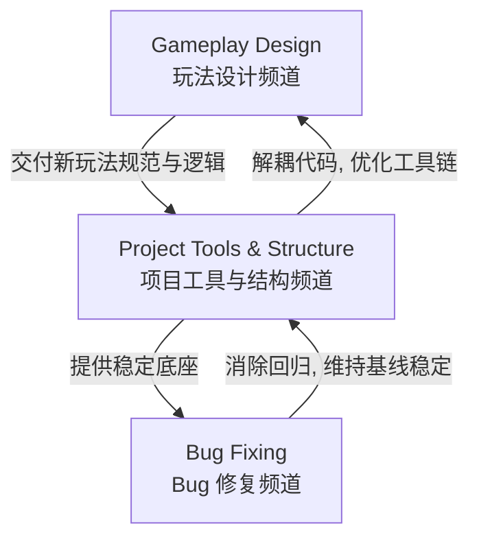

# Werewolf Ville 项目频道与工作流规划方案 (Antigravity Project Channels Plan)

本方案基于 [PROJECT_CONTINUITY.md](file:///G:/Trae-Project/werewolf-ville/PROJECT_CONTINUITY.md) 与 [AGENTS.md](file:///G:/Trae-Project/werewolf-ville/AGENTS.md) 制定，旨在为 **Werewolf Ville** 项目建立清晰的工作流频道（Channels / Workstreams），明确文件所有权，规范 Git 提交与 Worker 委派逻辑，并最大程度避免聊天上下文膨胀。

---

## 1. 频道与工作流定义 (Workstreams Definition)

项目开发工作划分为三个核心频道，各频道职责边界清晰，独立并行或顺序推进。

### 1.1 Gameplay Design (核心玩法设计频道)
*   **定位**：负责侦探推理、NPC 行为逻辑、NPC 间对话与记忆、夜晚追杀以及银器/反制等游戏机制的渐进式设计与实现。
*   **文件所有权**：
    *   逻辑实现：[agent.py](file:///G:/Trae-Project/werewolf-ville/agent.py)、[night_hunt.py](file:///G:/Trae-Project/werewolf-ville/night_hunt.py)、[simulation_events.py](file:///G:/Trae-Project/werewolf-ville/simulation_events.py)、[world_config.py](file:///G:/Trae-Project/werewolf-ville/world_config.py)
    *   静态配置：[personas/](file:///G:/Trae-Project/werewolf-ville/personas/) 中的基础人格设定模板
    *   设计文档：[docs/superpowers/specs/](file:///G:/Trae-Project/werewolf-ville/docs/superpowers/specs/)、[docs/superpowers/plans/](file:///G:/Trae-Project/werewolf-ville/docs/superpowers/plans/)
*   **准入条件 (Entry Criteria)**：
    1. 玩法设计方案已在 `docs/superpowers/specs/` 中通过审查，且已被更新至 `ROADMAP.md`（如有）。
    2. 当前 `BUG_BACKLOG.md` 中无处于阻碍开发状态（Blocker / Major）的未解决缺陷。
    3. 主 Agent 完成了针对本功能的子任务分解，并明确了 Worker 的具体指派。
*   **准出条件 (Exit Criteria)**：
    1. 对应功能编写的单元测试及集成测试全部通过（运行 `rtk pytest`）。
    2. 玩法逻辑能在前端 UI（Phaser）上平滑呈现，无阻塞进程。
    3. NPC 的对话内容与状态机变化正常，且未对 [personas/](file:///G:/Trae-Project/werewolf-ville/personas/) 下的静态人格配置造成运行态数据污染。

### 1.2 Bug Fixing (Bug 修复频道)
*   **定位**：负责收集、重现、修复游戏模拟、UI 渲染、数据传输或并发请求中出现的各类故障与退化问题。
*   **文件所有权**：
    *   全局缺陷库：`BUG_BACKLOG.md` (或 [TASK.md](file:///G:/Trae-Project/werewolf-ville/TASK.md) 中的专门 Bug 追踪区域)
    *   逻辑修正：涉及 Bug 的具体代码文件
    *   回归用例：[tests/](file:///G:/Trae-Project/werewolf-ville/tests/) 目录下的测试脚本
*   **准入条件 (Entry Criteria)**：
    1. 缺陷必须按标准格式记录在 `BUG_BACKLOG.md` 中（必须包含标题、严重度、复现步骤、实际表现、预期表现）。
    2. 具备至少一种能可靠复现的方法（例如特定测试用例或确定的前置状态）。
*   **准出条件 (Exit Criteria)**：
    1. 失败的测试用例恢复为 Green，或为该 bug 新增的 regression 单元测试通过。
    2. 通过执行 [restart.bat](file:///G:/Trae-Project/werewolf-ville/restart.bat) 重新启动服务并刷新浏览器（利用 IAB 浏览器客户端）确认修复，无界面错位或状态卡死。
    3. 在 `BUG_BACKLOG.md` 中更新状态为 `Closed`。

### 1.3 Project Tools/Structure (项目工具与结构频道)
*   **定位**：负责重构庞大的单体文件、优化模型接口与并发、提供项目辅助工具、维护启动脚本、健全静态模板与运行态记忆的隔离，以及建立版本控制基线。
*   **文件所有权**：
    *   状态机与游戏主循环：[game_engine.py](file:///G:/Trae-Project/werewolf-ville/game_engine.py)（以及未来拆分出的 `dusk_vote.py`、`tasks.py`、`silver_objectives.py` 等子模块）
    *   接口与基础组件：[llm.py](file:///G:/Trae-Project/werewolf-ville/llm.py)、[config.yaml](file:///G:/Trae-Project/werewolf-ville/config.yaml)、[config_loader.py](file:///G:/Trae-Project/werewolf-ville/config_loader.py)
    *   运维/启动：[restart.bat](file:///G:/Trae-Project/werewolf-ville/restart.bat)、[server.pid](file:///G:/Trae-Project/werewolf-ville/server.pid)
    *   核心规范：[PROJECT_CONTINUITY.md](file:///G:/Trae-Project/werewolf-ville/PROJECT_CONTINUITY.md)、[AGENTS.md](file:///G:/Trae-Project/werewolf-ville/AGENTS.md)
*   **准入条件 (Entry Criteria)**：
    1. 触发重构指标（如 `game_engine.py` 职责过载、API 兼容性受损、测试集运行效率显著下降）。
    2. 执行重构前，当前所有代码库处于测试全绿状态。
*   **准出条件 (Exit Criteria)**：
    1. 重构拆分出的文件必须通过 `python -m py_compile` 静态语法检查。
    2. 兼容性保持不变，所有已有测试用例无故障通过，新模块通过了初步性能/超时保底检查。
    3. 清理了可能存在的运行态临时垃圾，隔离规则生效。

---

## 2. Git 提交规范 (Git Commit Rules)

项目应尽快结束无版本控制的裸跑状态。各频道在代码变更时，须严格遵守以下 Git 提交规范：

| 变更类别 | 提交前缀示例 | 说明与要求 |
| :--- | :--- | :--- |
| **玩法实现** | `feat(gameplay): <说明>` | 新增机制、NPC 行动或修改人格配置模板 |
| **缺陷修复** | `fix(<模块>): <说明> (closes #bug_id)` | 修复逻辑或视觉 Bug，须对应 `BUG_BACKLOG.md` 中的项 |
| **重构/工具** | `refactor(<模块>): <说明>` | 拆分文件、优化基础工具、更新 `PROJECT_CONTINUITY.md` 等 |
| **测试补充** | `test(<模块>): <说明>` | 添加或更新 pytest 用例，不修改生产代码 |
| **日常琐事** | `chore(<模块>): <说明>` | 清理临时缓存文件、重置运行态数据等 |

> [!WARNING]
> 1. 严禁一次性提交跨频道的混合代码（例如同时提交玩法实现和不相关的 Bug 修复）。
> 2. 大范围重构（如拆分主状态机 `game_engine.py`）必须在独立的分支（如 `refactor-engine`）上进行，经验证无误后方可合并。

---

## 3. Worker 委派与分工规则 (Worker Delegation Rules)

为降低单次对话的上下文负荷，主 Agent 与 Subagents 间的职责委派必须遵循以下矩阵：

| 角色 | 推荐委派范围 | 前置验证要求 |
| :--- | :--- | :--- |
| **DeepSeek**   (Claude Code CLI) | <ul><li>复杂的后端游戏逻辑重构</li><li>并发和模型超时保底机制优化</li><li>逻辑测试用例设计与编写</li><li>主状态机逻辑深度审计</li></ul> | 1. 验证 `CLAUDE_BIN` 已配置为 native Windows 版本的 `claude.exe`。 2. 预检 DeepSeek key 文件有效且 CLI 能正常启动。 |
| **Antigravity**   (CLI Worker) | <ul><li>Phaser 前端 UI 绘制与布局微调</li><li>CSS 样式以及 WebSocket 报文格式调整</li><li>项目文档体系的整理与补充</li><li>数据隔离脚本与环境清理脚本编写</li></ul> | 1. 运行 Antigravity 诊断程序（doctor）。 2. 确认 `antigravity.exe` 处于 ready 状态。 |
| **主 Agent**   (主控与终审) | <ul><li>分配任务边界，分发子任务</li><li>合并 Subagents 产出的分支/代码</li><li>执行集成测试与最终的 IAB 浏览器截图验收</li></ul> | 1. 拦截不合规的跨目录修改。 2. 保证提交前运行回归测试。 |

---

## 4. 避免聊天上下文膨胀策略 (How to Avoid Chat Context Bloat)

长期开发中最忌上下文包含大量冗余的“运行时日志”、“重复报错”及“聊天细节”。应采取以下措施：

1.  **命令行静默化**：
    *   在执行所有普通的 Shell 命令（如 `pytest`、编译检查等）时，必须加上 `rtk` 前缀（例如：`rtk pytest tests`）。
    *   这能大幅压制无意义的控制台冗余输出，有效维持 Context Window 清洁。
2.  **缺陷与设计“外置”**：
    *   严禁在 chat 窗口内进行冗长的 bug 复现细节讨论。所有故障描述、日志堆栈均在 `BUG_BACKLOG.md` 维护，chat 中仅提及 bug 编号。
    *   新的设计思想、临时草案记录在 `docs/superpowers/plans/` 下，最终沉淀到 `PROJECT_CONTINUITY.md`。
3.  **单次提问专注度**：
    *   给 Subagent 派发任务时，应明确限制其改动范围及要读取的文件，不把整个仓库全部加载到 Subagent 的上下文内。
4.  **定期重置与重启**：
    *   经常使用 [restart.bat](file:///G:/Trae-Project/werewolf-ville/restart.bat) 来重置后端和清空临时 stdout/stderr log，避免它们由于体积过大而被自动化脚本误读。
