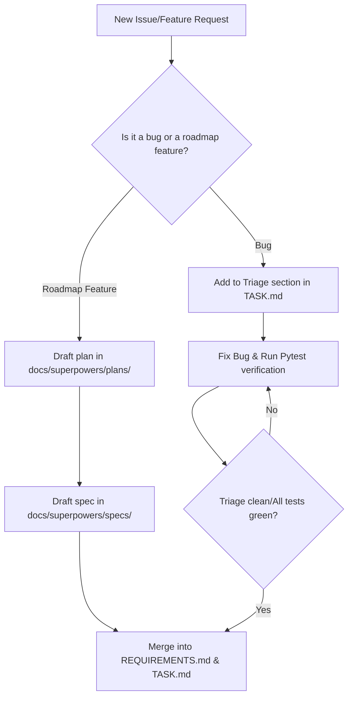

# Antigravity Project Process Audit

This document establishes the guidelines, recommendations, and processes for long-running project continuity and automation in the **Werewolf Ville** project.

---

## 1. Project Facts & Source of Truth

To ensure consistency across multiple agent invocations and human hand-offs, project facts are categorized into clear layers of truth:

*   **Active Sprint & Tasks**: [TASK.md](file:///G:/Trae-Project/werewolf-ville/TASK.md) serves as the primary task board tracking in-progress, completed, and pending work.
*   **Active Product Scope**: [REQUIREMENTS.md](file:///G:/Trae-Project/werewolf-ville/REQUIREMENTS.md) documents the current iteration's rules and features.
*   **Technical Design & Architecture**: [TECHNICAL_REPORT.md](file:///G:/Trae-Project/werewolf-ville/TECHNICAL_REPORT.md) and [TECHNICAL_REVIEW.md](file:///G:/Trae-Project/werewolf-ville/TECHNICAL_REVIEW.md) outline the technical architecture (such as the 6-role system constraints, simulation loop, and WebSocket mechanics).
*   **Feature Specifications**: Detailed design documents reside in the [docs/superpowers/specs/](file:///G:/Trae-Project/werewolf-ville/docs/superpowers/specs/) directory.
*   **Collaboration Standards**: [AGENTS.md](file:///G:/Trae-Project/werewolf-ville/AGENTS.md) defines workspace execution rules, subagent tool configuration, and environment setup.
*   **Character Configurations**: JSON/YAML definitions in [personas/](file:///G:/Trae-Project/werewolf-ville/personas/) detail NPC behaviors and system prompts.

> [!IMPORTANT]
> **Hierarchy of Facts**: When conflicting specifications arise, the order of precedence is:
> 1. [REQUIREMENTS.md](file:///G:/Trae-Project/werewolf-ville/REQUIREMENTS.md) (Active Feature Scope)
> 2. Specific feature designs in [docs/superpowers/specs/](file:///G:/Trae-Project/werewolf-ville/docs/superpowers/specs/)
> 3. [TECHNICAL_REPORT.md](file:///G:/Trae-Project/werewolf-ville/TECHNICAL_REPORT.md) (Architectural Baseline)

---

## 2. Product Roadmap vs. Bug Triage

To maintain a healthy, regression-free codebase, separate long-term expansion goals from tactical bug fixes.

### Recommendations:
1.  **Immutable Roadmaps**: Keep historical roadmap files in [docs/superpowers/plans/](file:///G:/Trae-Project/werewolf-ville/docs/superpowers/plans/) static (e.g., date-prefixed `YYYY-MM-DD-*.md`). Do not rewrite history. If a roadmap shifts, create a new date-prefixed plan file.
2.  **Separate Triage Logs**: Create a specific `# 🐛 Active Bug Triage` section in [TASK.md](file:///G:/Trae-Project/werewolf-ville/TASK.md) for regressions and bugs. Group bugs by severity:
    *   **Blocker**: Prevents simulation loop or server startup.
    *   **Major**: Core game mechanic failure (e.g. detective deduction, werewolf isolation breach).
    *   **Minor**: UI layout visual misalignment or non-blocking logs.
3.  **Triage-First Gate**: Never implement a new roadmap feature if there are active "Blocker" or "Major" bugs on the triage list.

---

## 3. Subagent Collaboration & Delegation Protocols

Collaborative coding tasks should be partitioned between available subagents to save context and optimize efficiency.

### Subagent Strengths & Division of Labor:
*   **DeepSeek (Claude Code CLI)**: Recommended for complex logic analysis, algorithmic refactoring, prompt engineering, and core game engine updates.
*   **Antigravity (CLI Worker)**: Recommended for UI design, CSS styling, WebSocket communication, file creation/cleanup, and local backend refactoring.

### Execution Protocol:
1.  **Preflight Validation**:
    *   *DeepSeek*: Confirm the native Windows `claude.exe` is configured via `CLAUDE_BIN` and that the DeepSeek key file is verified.
    *   *Antigravity*: Run the Antigravity CLI doctor (`antigravity doctor` or similar) to ensure the configured `antigravity.exe` is ready.
2.  **Scope Division**: Split non-trivial tasks into independent scopes (e.g. DeepSeek refactors `game_engine.py` while Antigravity updates UI CSS/JS).
3.  **Command Optimization**: Run all CLI actions using the `rtk` command prefix (e.g., `rtk pytest tests`) to suppress excessive terminal output and optimize model context size.

---

## 4. Maintenance of Planning & Context Files

To avoid context drift during long-running sessions, planning and context files must be maintained systematically.

*   **Interactive Task Tracking**: Update [TASK.md](file:///G:/Trae-Project/werewolf-ville/TASK.md) dynamically. Use `[ ]` for unstarted, `[/]` for in-progress, and `[x]` for completed tasks.
*   **Decision Logging**: When a significant architectural design is modified (e.g. changing WebSocket messaging format), append the decision to the "Decisions Log" section in [TECHNICAL_REPORT.md](file:///G:/Trae-Project/werewolf-ville/TECHNICAL_REPORT.md).
*   **Github-Style Links**: Always link to files and directories using absolute paths with the `file:///` scheme and forward slashes. For example, [ui/app.py](file:///G:/Trae-Project/werewolf-ville/ui/app.py).

---

## 5. UI Work Verification Strategy

Since web UI modifications require visual alignment and operational checks, use a three-pronged verification strategy:

### A. Lifecycle Server Management
Before verifying frontend updates, recycle the dev server:
1.  Run [restart.bat](file:///G:/Trae-Project/werewolf-ville/restart.bat) to terminate existing listeners on port 5000 and clean log files.
2.  Inspect `server.stderr.log` to confirm no startup compilation errors occurred.

### B. Visual Inspection (In-App Browser Client)
Since a direct browser tool may not be in the default toolset, use the browser plugin:
1.  Connect via the Node REPL client: `agent.browsers.get("iab")`.
2.  Navigate to `http://127.0.0.1:5000`.
3.  Verify CSS layout alignment (such as the right-side cards, custom bubbles, and dialog boxes).
4.  Capture screenshots to verify visual layouts.

### C. Automated Test Coverage
Add pytest validations for API responses and DOM element mappings:
*   Run tests regularly using `rtk pytest tests`.
*   Ensure that file structures like [ui/templates/index.html](file:///G:/Trae-Project/werewolf-ville/ui/templates/index.html) and [ui/app.py](file:///G:/Trae-Project/werewolf-ville/ui/app.py) are covered by UI-related pytest suites (e.g., [test_ui_bubble_layout.py](file:///G:/Trae-Project/werewolf-ville/tests/test_ui_bubble_layout.py)).
