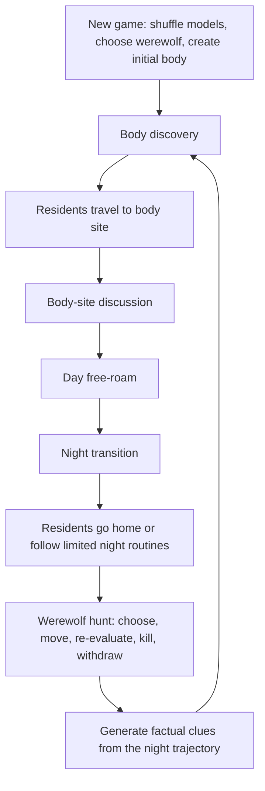

# Werewolf Ville Simulation Foundation Design

## Goal

Build a stable detective-exploration simulation before expanding the mystery game. A new game must run unattended as a believable town: residents follow map-valid routines, express coherent thoughts, move through day and night, react to a body, and produce traceable clues.

The current release remains a director-view build. It intentionally exposes private thoughts, raw model output, assigned models, and the true werewolf so simulation quality can be inspected.

## Product Boundary

- Six active text-only agents: Crow plus five residents.
- Six available text models are randomly shuffled across the six active characters at the start of each game.
- The werewolf is randomly selected from the five residents at the start of each game.
- The 25 upstream named resident sprites are reusable world assets. Characters without an active text model can appear as bodies or later as lightweight ambient residents.
- `G:\generative_agents-main` is a read-only upstream asset and concept source. Reuse its existing sprites, profiles, map vocabulary, and persona concepts before creating replacement assets.
- No vision, audio, or multimodal model input. Code turns map state into short textual observations.

## Architecture Choice

Use an event-driven simulation state machine with a rules-engine backbone and LLM performance layer.

The rules engine owns world truth: time, phase, map vocabulary, paths, visibility, bodies, clues, witnessed events, legal actions, and win conditions. Models receive compact textual summaries and choose among legal options. Models may add personality and dialogue, but cannot create new world facts.

This replaces the current pattern where free-form reflection can invent locations or events, write them to memory, and amplify the invention over later turns.

## Map-Aligned Active Characters

| Character | Stable public role | Primary routine location |
|---|---|---|
| Arthur Burton | Hardware store owner and tool repairer | Harvey Oak Supply Store |
| Isabella Rodriguez | Cafe owner | Hobbs Cafe |
| Klaus Mueller | College lecturer or researcher | Oak Hill College |
| Maria Lopez | Market and pharmacy clerk | The Willows Market and Pharmacy |
| Sam Moore | Pub owner or bartender | The Rose and Crown Pub |
| Crow | Detective | Whole-town patrol |

`Johnson Park` is a shared public location for walking, encounters, body discovery, and night travel.

Wolf identity is independent from public occupation. Base persona files must not permanently encode Arthur or any other resident as the werewolf.

## Role Goals

### Villager

1. Maintain a normal daily life.
2. Notice code-generated anomalies.
3. Investigate suspicious events when appropriate.
4. Preserve new factual clues.
5. Share clues during a body-site gathering or when Crow interviews them.

### Detective

1. Find the werewolf.
2. Patrol the town and interview residents.
3. Collect delivered clues.
4. Compare statements against code-generated events.
5. Make a final accusation.

### Werewolf

1. Maintain a believable public routine during the day.
2. Hide identity and reduce traces.
3. At night, choose a target, travel through the map, dynamically switch targets if needed, kill exactly one eligible victim, and withdraw.
4. Kill Crow only after all other eligible residents are dead.

## Simulation Phases



The initial body comes from a named upstream resident sprite not used by an active agent. It is rendered prone or rotated and gray-tinted. It does not consume a model.

After each night, the next gathering happens near the newly discovered body rather than at a fixed square. If no resident naturally discovers the body early enough, the engine uses a morning fallback discovery so the loop cannot stall.

## World Truth And Text Observation

The engine computes:

- coordinates and paths;
- time and phase;
- map-valid locations and nearby objects;
- visible residents and bodies;
- witnessed movement and suspicious night activity;
- legal action candidates;
- body site and physical clue facts;
- target risk, route length, remaining night time, and likely witnesses.

Models receive short text such as:

```text
You are at Hobbs Cafe.
Visible: Sam Moore is walking toward Johnson Park.
New factual clue: you saw a person leave the park at 23:40.
Legal destinations: Hobbs Cafe, Johnson Park, home.
```

Model output is validated before execution. Invalid places, people, objects, and unsupported facts are rejected. A failed model request falls back to a profession-appropriate action without blocking the town.

## Clue Flow

Clues are structured engine facts, not model inventions.

Examples:

- witness saw a resident pass a location during a time window;
- body was found at a map coordinate;
- footprints or disturbed objects were found near the body;
- a resident's stated alibi conflicts with an engine-recorded event;
- a resident returned home late or deviated from a normal routine.

Each villager stores private clue records with delivery state. A new undelivered clue lights a bulb icon on that resident's right-panel card. The bulb does not appear for emotions, guesses, or ordinary suspicion.

Crow must approach and talk to the resident to receive the clue. Body-site discussion may also reveal selected clues publicly.

## Night Hunt

Night remains a five-minute simulation window. It is faster-paced than daytime but still uses physical map movement.

1. Eligible residents follow home or limited profession/event-based night routines.
2. The engine scores targets by distance, isolation, path length, visibility risk, and remaining time.
3. The LLM chooses among legal candidates using the current werewolf persona and context.
4. The engine re-evaluates periodically. The werewolf may switch targets.
5. A kill must occur every night. As the deadline approaches, the engine increases completion pressure and may choose an easier target.
6. Harder or more exposed hunts create more factual clues.
7. The werewolf withdraws after the kill.

## UI Requirements

Director-view UI should show:

- randomly assigned model per active character;
- current public role and true runtime role;
- current phase and sub-phase;
- current action, target, path state, thought, and latest raw model output;
- bodies on the map as gray prone sprites;
- clue bulb on villagers with undelivered clues;
- body-site gathering state;
- night-hunt state, including target changes and elapsed time.

The first version keeps private thought visibility because its purpose is simulation debugging.

## Error Handling

- Empty, refused, malformed, or rate-limited model responses trigger bounded retries and profession-specific fallback actions.
- Invalid destinations are rejected before state mutation.
- Long model text is truncated for UI and memory storage.
- A night hunt that is not complete near the deadline escalates toward a reachable target.
- Morning fallback discovery prevents a deadlock if no NPC naturally discovers the body.
- Structured events and clues remain valid even when a model request fails.

## Delivery Split

### Plan 1: Daytime Simulation Foundation

- Move map-aligned persona configuration into code-owned structured data.
- Neutralize base personas and inject runtime roles.
- Randomize model assignment and werewolf identity per game.
- Add initial body entity and body-site gathering.
- Add structured facts, clues, clue bulbs, and Crow clue delivery.
- Keep current daytime movement while validating legal world vocabulary.

### Plan 2: Physical Night Hunt And Morning Loop

- Add night-specific state machine.
- Add limited resident night routines.
- Add scored target candidates and dynamic replanning.
- Move the werewolf physically, perform one guaranteed kill, and withdraw.
- Generate clues from real night events.
- Start the next body-discovery gathering.

## Verification

- Start multiple games and confirm both the model-character mapping and werewolf change.
- Run a game without player input and confirm the first body-site gathering completes and residents disperse into map-valid routines.
- Confirm no model-created location becomes executable world state.
- Confirm a villager with a factual clue shows a bulb until Crow receives the clue.
- Run through night and confirm exactly one victim dies, the werewolf physically moves, clues are created from events, and the next morning gathers residents near the body.

