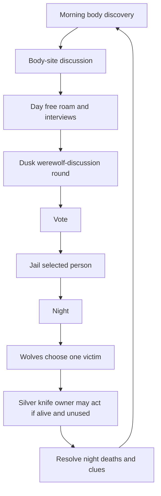

# Werewolf Ville Gameplay Expansion Design

## Goal

把当前的导演视角模拟，扩展成一个更接近狼人杀但仍然保留侦探探索的小镇推理游戏。

核心体验是：玩家控制警长 Crow，在一个 8 人局里通过白天对话、线索追踪、黄昏投票、夜间死亡、银质武器任务和 NPC 自主行动，逐步判断两个狼人是谁。

## Non-Negotiable Requirements From User

- 活跃参与者以 8 人为主：Crow 加 7 个 NPC。
- 每局随机选择 2 个狼人，狼人不能是 Crow。
- 两个狼人知道彼此身份，可以白天互相掩护。
- 每个 NPC 在晨会、白天行动、黄昏讨论、投票、夜晚行动中都必须基于自己的私有记忆、公开记忆、目标和可见事件独立决策，不能退化成固定句式或全局脚本。
- 身份、银质小刀、银饰持有人、狼人干扰、个人线索都必须是信息黑盒：除持有者、观察者或规则允许的共享对象外，其他 NPC 不知道真相，只能根据观察和对话推理。
- 白天聊天结束后进入黄昏讨论和投票。
- 投票不会直接杀人，被投出者由警长 Crow 关进监狱，等价于死亡：不能移动、不能投票、不能被访谈、不能夜间行动。
- 克罗警长所在位置的三间房全部属于警长区域：一间是克罗警长的房间/办公室，剩下两间都是监狱牢房。
- 被投出者发表遗言后，Crow 必须把他实际押送到两间牢房之一，而不是只在状态里标记为监禁。
- 每晚狼人最多并且必须杀 1 人；如果两个狼人都活着，也只能总共杀 1 人。
- 第一天居民不知道凶手是狼人，只能从尸体看到野兽撕咬痕迹。
- 游戏开头 Crow 必须用多段气泡向玩家和 NPC 交代背景：自己是小镇警长、昨晚发生命案、死者是谁、尸体疑似有野兽抓痕或咬痕、具体死因仍需调查、他会逐一问话、NPC 有线索会通过右侧灯泡提示玩家。
- Crow 开场说明结束后，先问所有人“昨晚大家都在做什么”。
- 第一轮行踪发言结束后，Crow 要说“你们先去做自己的事，我会在黄昏再召集大家讨论”，然后 NPC 才逐个说明要去做什么并离开。
- 第一天必须有 NPC 去图书馆查询，并发现“凶手可能是狼人”的可能性。
- 第一天黄昏投票前的讨论必须提出“凶手可能是狼人”。
- 第二天如果尸体仍是野兽撕咬，Crow 判定凶手是狼人。
- Crow 要制造一颗银质子弹，最多只能杀一个狼人。
- Crow 第二天和第三天每天只能完成一件银弹相关任务。
- 银弹任务包括：
  - 去五金店找店主获取制造银质子弹的工具。
  - 找一个女性 NPC 获取银质饰品作为银料。
- 如果五金店老板或持有银饰的女性 NPC 是狼人，可以拒绝、谎称丢失、提前藏匿或阻挠。
- 狼人也可以主动干扰：提前买走工具、借走或偷走银饰。
- 被干扰的五金店老板或女性 NPC 会知道是谁买走或借走了东西，这会形成线索。
- 好人阵营中有一个隐藏银质小刀持有者。
- 银质小刀持有者不能是 Crow，也不能是狼人。
- 银质小刀持有者自己知道自己有刀，但默认不会告诉别人。
- 银质小刀只能用一次，夜晚选择杀一个人。
- 小刀杀普通 NPC 会杀死普通 NPC；杀狼人也会杀死狼人。
- 狼人如果推理出谁有银质小刀，可以在小刀使用前优先杀死他。
- 狼人在最后一轮之前的死亡方式只有：
  - 白天被投票关进监狱。
  - 晚上被银质小刀杀死。
- Crow 第四天才能造出银质子弹并选择一个目标射杀。
- 如果第四天 Crow 杀死一个狼人后还有一个狼人活着，基本视为好人败局或进入极高风险终局。
- 右侧 NPC 列表必须包含每个 NPC 的操作按钮：
  - 记录：查看大模型历史。
  - 灯泡：该 NPC 有新线索或重要想法时亮起。
  - 交谈：Crow 自动走到 NPC 身边，NPC 先发言。
  - 深入挖掘：普通交谈后显示，消耗全局 3 次机会。
- 每天 Crow 可以和每个 NPC 普通交谈一次。
- 深入挖掘机会总共 3 次，不按天重置。
- UI 必须常驻显示深入挖掘剩余次数，例如 `深入挖掘：2 / 3`。
- 深入挖掘点击后弹出较大的输入框，玩家先输入 Crow 要说的话；确认后 Crow 走到 NPC 身边，Crow 先说，NPC 再回复。
- 右下角需要任务列表。
- 右侧 UI 不提供“进入夜晚”按钮；白天主要推进按钮是“结束本回合开始讨论”。
- 点击“结束本回合开始讨论”后，所有可参与者聚集，进入黄昏讨论和投票流程。
- NPC 全部投票完成后，必须展示投票汇总 UI 面板，列出“谁投了谁”和每个人获得几票，然后再让玩家决定最终投谁或由 Crow 裁决。
- 被投出/被裁决入狱的人必须先发表遗言。
- 遗言结束后，Crow 带该人回监狱，并说一段入夜提醒，例如“我先带他去监狱，马上天黑了，大家回去锁好门”，然后才进入夜晚。
- 第一天任务：和另外 7 个 NPC 对话，显示 `n/7`。
- 每一天都有“和每个存活可交谈 NPC 对话”的任务。
- 第二天开始出现银弹资源任务。
- 第三天任务根据第二天进度只显示剩余资源。
- 第四天出现可选任务：选择一个疑似狼人用银质子弹射杀。
- 游戏内所有玩家可见姓名、地点、任务、行动描述、按钮文案和模型发言都使用中文显示。代码内部可以保留稳定英文 id，但不能把英文名直接显示给玩家。

## Current Code Context

当前项目已有这些可复用基础：

- `world_config.py`：6 名活跃角色、公共地点、初始尸体位置。
- `game_engine.py`：游戏主状态机、晨会、白天行动、夜间狼人追杀、线索、访谈、状态序列化。
- `night_hunt.py`：夜间追杀候选、线索生成。
- `simulation_events.py`：尸体和线索数据结构。
- `ui/templates/index.html`：Phaser 地图、右侧列表、聊天面板、气泡、任务区域可扩展。
- `ui/app.py`：HTTP 和 socket API。
- 测试覆盖已经包含角色随机、夜间追杀、晨会超时、碰撞、线索交付、UI 供应商配置等。

当前必须调整的前提：

- 现在活跃角色只有 6 个，要扩展到 Crow + 7 NPC。
- 现在只有 1 个狼人，要扩展为 2 个狼人。
- 现在有晨会和夜间杀人，但没有黄昏投票/监狱阶段。
- 现在 Crow 对话和深入挖掘是基础版本，要重做成右侧 NPC 卡片按钮驱动。
- 现在线索灯泡只覆盖 factual clue，要扩展到“新线索或重要想法”的提示，但仍然必须区分事实线索和主观想法。

## Recommended Architecture

采用“规则引擎决定世界事实，LLM 只做表达和有限决策”的架构。

新增模块建议：

- `roles.py`：阵营、特殊身份、可见/隐藏身份、胜负判断。
- `dusk_vote.py`：黄昏讨论、投票、平票处理、监禁结算。
- `silver_objectives.py`：狼人知识进度、银弹资源、工具、银饰、狼人干扰、子弹制作。
- `knife_role.py`：隐藏银质小刀持有者、夜间使用、小刀击杀事件。
- `tasks.py`：Crow 任务列表、每日对话进度、银弹任务进度、第四天射击任务。

`game_engine.py` 保留总编排职责，但应逐步把规则逻辑委托给以上模块，避免继续扩大单文件复杂度。

## Active Cast Design

8 人局定义为：

- 克罗警长：玩家控制，不能是狼人，不能持有银质小刀。内部 id 可以继续使用 `Crow`，但玩家可见名必须是中文。
- 7 个活跃 NPC：从现有 25 个角色资源中选择，全部拥有文本模型或共享模型配置。
- 2 个狼人：从 7 个 NPC 中随机选择。
- 1 个银质小刀持有者：从非狼人、非 Crow 的 NPC 中随机选择。
- 1 个银饰持有者：从女性 NPC 中随机选择，可以是狼人；如果是狼人，会阻挠 Crow。
- 五金店老板：优先为亚瑟·伯顿；也可以是狼人，因为公开职业和狼人身份独立。
- 图书馆查询者：优先为克劳斯·穆勒或新增学院/图书馆角色。

建议扩展后的 7 个 NPC：

| 玩家可见姓名 | 公开职业 | 主要地点 | 玩法用途 |
|---|---|---|---|
| 亚瑟·伯顿 | 五金店老板/工具修理 | 哈维橡树五金店 | 银弹工具关键 NPC |
| 伊莎贝拉·罗德里格斯 | 咖啡店老板 | 霍布斯咖啡馆 | 社交线索/银饰候选 |
| 克劳斯·穆勒 | 学院学生或研究者 | 橡树山学院 | 第一天图书馆查询狼人可能性 |
| 玛丽亚·洛佩兹 | 市场药房店员 | 柳树市场药房 | 医疗/伤口线索/银饰候选 |
| 山姆·摩尔 | 酒馆老板 | 玫瑰皇冠酒馆 | 夜间目击/流言线索 |
| 简·莫雷诺 | 学院图书馆管理员或学生 | 橡树山学院 | 图书馆查询备用角色 |
| 林梅 | 公园志愿者/市场常客/银饰持有候选 | 约翰逊公园/市场 | 银饰候选/隐藏刀候选 |

如果后续发现新增角色与场景位置不匹配，可以从 25 个 sprite 中替换，但必须保持职业和地图地点绑定。

## Sheriff Office And Prison Rooms

地图上克罗警长所在区域的三间房要作为一个明确的玩法地点使用：

- 第一间：克罗警长的房间/办公室，用于警长身份、案件记录、后续银弹制作或关键任务表现。
- 第二间：监狱牢房 A。
- 第三间：监狱牢房 B。

监禁流程：

- 黄昏投票结束后，被监禁者先在现场发表遗言。
- 遗言结束后，Crow 带他从讨论地点移动到警长区域。
- 到达后，被监禁者进入牢房 A 或牢房 B 的可用站位。
- 牢房是两个房间，不是两个单人容量格；每个牢房需要配置多个站位锚点，避免第三个被监禁者无处可放。
- 被监禁者留在牢房区域内，不再参与移动、对话、投票和夜间行动。
- UI 和日志要表现为“关进监狱/牢房”，不要表现成死亡或从地图消失。

## NPC Autonomy And Information Isolation

这个项目的关键不是让 NPC 播放固定剧情，而是让每个 NPC 在规则约束下像狼人杀玩家一样独立运作。规则引擎掌握世界真相；每个 NPC 只能接收自己应该知道的信息切片，并把未知部分当作黑盒。

每个 NPC 至少需要这些状态：

- 公开身份：姓名、职业、日常地点、当日可见行为。
- 私有身份：是否狼人、是否银质小刀持有者、是否银饰持有人、是否掌握特定线索。
- 私有记忆：自己昨晚做了什么、看见了什么、隐瞒了什么、对谁有怀疑。
- 公开记忆：晨会发言、公开尸体信息、黄昏讨论、公开投票、被玩家问出的线索。
- 推理状态：对每个角色的怀疑度、信任度、想保护或想陷害的人。
- 当前目标：正常生活、协助 Crow、隐藏身份、保护狼队友、交付线索、误导投票、夜间行动等。

信息隔离规则：

- 狼人只额外知道狼队友是谁，不自动知道银质小刀持有者、银饰持有人、Crow 的真实计划或其他 NPC 私有线索。
- 银质小刀持有者只知道自己有刀，不知道狼人是谁，除非通过线索推理。
- 线索提供者只知道自己亲眼看到或合理推理出的内容，不知道规则引擎真相。
- 普通 NPC 不知道谁是狼人、谁有刀、谁有银饰，除非该信息被公开或由自己观察到。
- Crow/玩家不自动知道隐藏身份，只能通过对话、任务、投票和现场线索获得信息。
- 导演视角可以展示真相用于调试，但这些内容不能进入普通 NPC prompt、气泡、右侧卡片或玩家可见普通日志。

模型驱动环节：

- 晨会：NPC 基于昨晚私有记忆回答行踪，可以说真话、隐瞒、紧张、误判，但不能知道自己不该知道的身份。
- 白天行动：NPC 根据职业日程和当前目标选择具体地点或物件，不允许只说“去图书馆”却不靠近书架、档案柜等可操作对象。
- 黄昏讨论：NPC 基于公开讨论、私有线索、怀疑度和阵营目标独立发言，不使用固定模板。
- 投票：NPC 由模型给出投票目标和简短理由；规则引擎只负责限制候选合法性和结算结果。
- 夜晚：狼人、持刀者和普通 NPC 都按各自私有目标行动；没有夜间能力的人仍应回家或执行合理生活行为。

## Knowledge Progression

## Opening Narrative And First Morning Script

开局不是直接让 NPC 轮流说话，而是先让 Crow 用多段气泡承担“故事背景 + 玩法提示”的功能。由于单个气泡不能太长，系统应该把 Crow 的开场拆成 3 到 5 段短气泡顺序播放。

建议内容顺序：

1. Crow 自我介绍：他是这个小镇的警长，负责调查昨晚命案。
2. 说明案件：昨晚某个居民遇害，尸体已被发现。
3. 说明初步尸检：身体上疑似有野兽抓痕或咬痕，但具体死因还需要白天调查。
4. 说明玩家目标：Crow 会逐一找大家问话，核实昨晚行踪。
5. 说明 UI 线索提示：如果有人发现线索或有重要想法，右侧列表里的灯泡会亮，玩家可以去找他谈。

开场说明之后，Crow 才向所有人提问：“昨晚大家都在做什么？”

第一轮所有 NPC 只回答昨晚行踪和初步态度，不离开。第一轮结束后，Crow 再说：“好吧，你们先去做自己的事。我会在黄昏的时候再召集大家来讨论。”然后进入第二轮，NPC 逐个说明自己要去哪里、为什么离开。

### Day 1

公开事实：

- 有前置尸体。
- 尸体伤口是“野兽撕咬痕迹”。
- 没有人一开始公开知道是狼人。

强制剧情线索：

- 一个学院/图书馆角色白天去 Oak Hill College 的书架或图书馆对象查询。
- 他发现旧档案中存在“狼人袭击”的记载。
- 这条发现成为该 NPC 的新线索，灯泡亮起。
- 黄昏投票前讨论时，该 NPC 或系统推动的发言必须提出“凶手可能是狼人”。

### Day 2

公开事实：

- 第二具尸体也有野兽撕咬。
- Crow 判定凶手是狼人。

解锁目标：

- 银质子弹资源线开始。
- Crow 每天只能完成一个资源获取行动。
- 玩家可以选择先拿工具或先拿银饰。

### Day 3

继续资源线：

- 如果 Day 2 已拿工具，Day 3 任务只剩银饰。
- 如果 Day 2 已拿银饰，Day 3 任务只剩工具。
- 如果 Day 2 失败，Day 3 仍显示缺失资源，并保留失败产生的线索。

### Day 4

如果 Crow 拥有工具和银饰：

- 可以制作 1 颗银质子弹。
- 可选任务：选择一个疑似狼人射杀。
- 子弹只能用一次。
- 如果射中狼人，狼人死亡。
- 如果射中好人，目标死亡，Crow 丧失银弹胜利手段。

## Daily Phase Flow



黄昏阶段是新增关键阶段。建议把 `GamePhase` 从 `DAY/NIGHT/GAME_OVER` 扩展为：

- `DAY`
- `DUSK_DISCUSSION`
- `DUSK_VOTE`
- `NIGHT`
- `GAME_OVER`

或者保持 `DAY`，新增 `day_subphase`。推荐显式新增 phase，便于 UI、测试和任务系统判断。

## Dusk Voting Rules

触发方式：

- 右侧 UI 不显示“进入夜晚”按钮。
- 白天由玩家点击“结束本回合开始讨论”推进。
- 点击后所有存活且未监禁的参与者聚集到讨论地点，开始黄昏讨论。
- 黄昏讨论结束后进入投票。

可投票者：

- 存活且未被监禁的人。
- Crow 参与投票，玩家选择 Crow 的票。
- NPC 由 LLM 在合法候选中投票。
- 狼人会倾向保护彼此、转移怀疑、投给好人或银质小刀嫌疑人。

投票 UI：

- NPC 先全部投票。
- NPC 投票结束后显示投票汇总面板。
- 面板必须列出每一票：`投票者 -> 被投票者`。
- 面板必须列出每个候选人的得票数。
- 玩家看到票型后，再选择 Crow 的最终投票或裁决目标。

结算：

- 得票最高者被 Crow 关进监狱。
- 被监禁者等价于死亡：不能移动、不能参与对话、不能投票、不能夜间行动。
- 如果被监禁的是狼人，则该狼人被消灭。
- 如果平票，建议 Crow 拥有最终裁决权；如果玩家不裁决，则无人入狱。推荐 Crow 裁决，因为这增加玩家责任。
- 被监禁者在离开前必须发表遗言。
- 遗言结束后，Crow 要带他去监狱，并发表入夜仪式台词，提醒大家天黑后回家锁门。
- Crow 台词结束后才正式进入夜晚。

## Werewolf Team Rules

两个狼人共享这些信息：

- 彼此身份。
- 夜间目标选择。
- 银弹工具/银饰是否被 Crow 获取。
- 是否推理出银质小刀持有者。

白天行为：

- 狼人必须保持职业日程。
- 狼人可以互相掩护。
- 狼人不能直接暴露“我是狼人”。
- 狼人可制造假怀疑或推动投票关押好人。

夜间行为：

- 每晚狼人团队只能杀一个目标。
- 如果两个狼人都活着，可以让其中一人执行物理移动和击杀，另一人制造不在场证明或干扰。
- Crow 只能在其他非狼人居民都无法成为目标后才可被杀。

干扰行为：

- 买走或藏起五金店工具。
- 借走、偷走或伪造银饰丢失。
- 试图找出银质小刀持有者。
- 干扰行为必须产生可追踪事实线索，不能只是模型文本。

## Silver Bullet Resource System

资源状态：

```text
tool_status: missing | available | obtained_by_crow | taken_by_wolf | unavailable
silver_status: missing | available | obtained_by_crow | taken_by_wolf | unavailable
bullet_status: none | craftable | crafted | fired
crow_major_action_used_today: true | false
```

工具获取：

- 地点：Harvey Oak Supply Store。
- NPC：五金店老板。
- Crow 必须移动到店主附近并交谈。
- 如果店主不是狼人且工具未被取走，Crow 获取工具。
- 如果店主是狼人，店主会拒绝、拖延、谎称没有工具或说已被买走。
- 如果工具被狼人提前买走，店主知道买走者，形成线索。

银饰获取：

- 持有人：女性 NPC，开局随机。
- Crow 必须移动到该 NPC 附近并说服。
- 如果持有人不是狼人且银饰未被取走，Crow 获取银饰。
- 如果持有人是狼人，会拒绝或谎称丢失。
- 如果银饰被狼人提前借走/偷走，持有人知道或怀疑是谁，形成线索。

每日限制：

- Day 2 起，Crow 每天只能完成一个银弹资源行动。
- 普通对话不消耗这个“重大任务”次数。
- 深入挖掘也不消耗重大任务次数，除非它同时触发资源获取。

## Silver Knife Role

开局随机选择一个好人 NPC 持有银质小刀。

规则：

- Crow 不能持刀。
- 狼人不能持刀。
- 持刀者默认保密。
- 小刀只能使用一次。
- 小刀在夜晚行动。
- 小刀目标可以是任意存活且未监禁 NPC，原则上不应自动选择 Crow。
- 杀中狼人：狼人死亡。
- 杀中好人：好人死亡。
- 持刀者如果在使用前死亡，小刀失效。

AI 行为：

- 持刀者应根据白天线索、投票、对话、狼人可能性来决定是否使用。
- 早期信息不足时可以选择不使用。
- 如果持刀者强烈怀疑某人是狼人，可以夜晚使用。

狼人反制：

- 狼人可以通过对话、线索和行为推理谁可能持刀。
- 如果狼人怀疑某人持刀，可以优先杀死他。
- 推理过程应留下可观察线索，例如狼人询问银器、跟踪某人、夜间接近持刀者。

## Conversation Rules

普通交谈：

- 每天 Crow 可以和每个可交谈 NPC 普通交谈一次。
- 右侧 NPC 卡片显示“交谈”按钮。
- 点击后 Crow 自动走到 NPC 身边。
- 到达后 NPC 先发言，把当前最重要的线索、想法或状态告诉 Crow。
- 交谈结束后该 NPC 当天“交谈”按钮隐藏。

深入挖掘：

- 普通交谈结束后，如果全局深入挖掘次数仍大于 0，该 NPC 卡片显示“深入挖掘”按钮。
- 点击后弹出较大的输入框。
- 玩家输入 Crow 要说的话。
- 确认后 Crow 自动走到 NPC 身边。
- Crow 先发言，NPC 根据 Crow 的问题回复。
- 深入挖掘总次数为 3，整个游戏不重置。

对话结果：

- 如果 NPC 有 factual clue，普通交谈或深入挖掘可交付给 Crow。
- 如果 NPC 只有主观想法，灯泡可以亮，但 UI 应标注为“想法”或在记录中区分。
- 交谈生成的事实不能凭模型自由创造，必须来自 engine 记录或被标为主观怀疑。

## Right Panel UI

每个 NPC 卡片应显示：

- 名字。
- 公开身份/职业。
- 当前状态：活着、死亡、被监禁、失踪、夜间不可见等。
- 记录按钮。
- 灯泡按钮或图标。
- 交谈按钮。
- 深入挖掘按钮。

按钮规则：

- `记录` 永远可用。
- `灯泡` 有新线索或重要想法时亮起；点击可聚焦该 NPC 或展开提示摘要。
- `交谈` 仅当该 NPC 今天尚未普通交谈、可交谈、未死亡、未监禁时显示。
- `深入挖掘` 仅当该 NPC 今天已普通交谈、全局深入次数剩余、可交谈、未死亡、未监禁时显示。

右下角任务列表：

- 固定显示当前日任务。
- 固定显示全局深入挖掘剩余次数，位置可以在任务列表标题旁或任务列表第一行。
- 任务包括进度、完成状态和可选标记。
- 不再依赖常驻底部聊天输入作为主交互入口。

## Task List Rules

每日基础任务：

- `和镇民交谈：n / 当前可交谈 NPC 数`
- 每天重置普通交谈进度。
- 死亡或监禁者不计入当天可交谈目标。

Day 1：

- 和 7 名 NPC 交谈。
- 了解尸体伤口和昨晚行踪。
- 可选：询问图书馆线索持有者。

Day 2：

- 和可交谈 NPC 交谈。
- 银弹资源任务：获取工具或获取银饰，二选一完成。

Day 3：

- 和可交谈 NPC 交谈。
- 完成剩余银弹资源任务。

Day 4：

- 和可交谈 NPC 交谈。
- 如果子弹可制作，显示：制作银质子弹。
- 如果子弹已制作，显示可选任务：射杀一个疑似狼人。

## Win And Loss Conditions

好人胜利：

- 两个狼人都被消灭。
- 消灭方式可以是投票监禁、小刀击杀、Crow 银弹射杀。

狼人胜利：

- 狼人数量大于或等于未监禁好人数量。
- Crow 被杀。
- 到第四天 Crow 射杀一个狼人后仍有一个狼人存活，进入狼人优势终局；建议在原型中直接判狼人胜利，减少拖沓。

特殊失败：

- Crow 银弹射杀好人，且两个狼人仍存活，基本判定好人失败或进入极低胜率状态。

## Data Model Additions

建议新增状态：

```python
werewolf_names: set[str]
jailed_names: set[str]
silver_knife_holder: str
silver_knife_used: bool
silver_knife_target_history: list[dict]
silver_jewelry_holder: str
wolf_team_known: dict[str, list[str]]
werewolf_theory_state: "unknown" | "suspected" | "confirmed"
silver_tool_status: str
silver_jewelry_status: str
silver_bullet_status: str
crow_major_action_day: int | None
daily_conversations: dict[int, set[str]]
deep_dive_used_total: int
tasks: list[TaskRecord]
votes_by_day: dict[int, VoteRecord]
display_names_zh: dict[str, str]
private_memory_by_agent: dict[str, list[MemoryRecord]]
public_memory: list[MemoryRecord]
knowledge_by_agent: dict[str, KnowledgeRecord]
suspicion_by_agent: dict[str, dict[str, float]]
current_goal_by_agent: dict[str, GoalRecord]
prison_cell_locations: list[str]
jail_cell_assignments: dict[str, str]
```

`display_names_zh` 用于所有 UI 和模型可见文本；内部英文 key 只作为代码引用，不进入玩家可见内容。

`private_memory_by_agent` 和 `knowledge_by_agent` 是信息黑盒的核心。构造 prompt 时必须先按 agent 过滤，只传入该 agent 的公开记忆、私有记忆、个人身份、个人目标和允许共享的队友信息。

建议新增事件类型：

- `BodyWoundEvent`
- `LibraryResearchEvent`
- `DuskDiscussionEvent`
- `VoteCastEvent`
- `JailEvent`
- `SilverToolEvent`
- `SilverJewelryEvent`
- `WolfInterferenceEvent`
- `SilverKnifeUseEvent`
- `SilverBulletShotEvent`

## Prompting And Model Rules

通用 prompt 构造规则：

- 每次模型调用都必须以“当前发言者/行动者”为边界构造上下文。
- 输入只能包含该 NPC 的公开记忆、私有记忆、已观察事件、公开讨论、个人目标和规则允许知道的隐藏信息。
- 不允许把完整 `werewolf_names`、`silver_knife_holder`、`silver_jewelry_holder` 或导演摘要传给普通 NPC。
- 黄昏讨论、投票、夜间行动都必须由模型产出简短理由或意图，再由规则引擎验证候选、位置、道具和结算是否合法。
- 模型输出可以撒谎、误判、隐瞒或表达怀疑，但不能改写世界真相。
- 所有模型可见/输出的姓名、地点、行动描述都使用中文显示名。

狼人 prompt 必须包含：

- 你是狼人。
- 你的狼队友是谁。
- 白天你必须隐藏身份。
- 你可以帮狼队友掩护。
- 你不知道银质小刀持有者是谁，除非你通过线索推理出来。
- 你不知道其他 NPC 的真实私有想法。
- 不能直接说出系统秘密。
- 夜晚团队只能杀一人。
- 如果你阻挠银器资源，必须给出合理公开理由。

普通 NPC prompt 必须包含：

- 你不知道谁是狼人，除非你拥有具体线索。
- 你可以怀疑，但要区分事实和猜测。
- 如果你有新线索，优先告诉 Crow。
- 如果你是银质小刀持有者，不要主动公开，除非生死攸关。
- 如果你只是线索提供者，你只知道自己观察到的线索，不知道线索背后的全部真相。

Crow prompt / player-facing rules：

- Crow 不自动知道狼人。
- Day 2 后 Crow 才确认狼人可能性。
- Crow 的银弹只能用一次。

## Testing Strategy

必须先补测试再实现：

- 8 人局初始化：Crow + 7 NPC，2 狼，1 刀，1 银饰。
- 狼人彼此知道身份，普通 NPC 不知道。
- 普通 NPC prompt 不包含完整狼人名单、小刀持有者、银饰持有者或导演摘要。
- 狼人 prompt 只包含狼队友，不包含小刀持有者和其他 NPC 私有想法。
- 小刀持有者身份只出现在该 NPC 自己的私有 prompt 中。
- 黄昏讨论和投票都调用 NPC 独立决策，不使用固定投票句式。
- 所有玩家可见姓名、地点、任务和行动文案都使用中文显示名。
- Day 1 图书馆线索必定出现。
- Day 1 黄昏讨论必须提出狼人可能性。
- Day 2 第二具撕咬尸体后 Crow 确认狼人。
- 投票会把人放入监狱而不是普通死亡。
- 克罗警长区域包含一间警长房/办公室和两间监狱牢房。
- 被监禁者会被实际移动到牢房区域，且多个被监禁者不会重叠。
- 被监禁者不能移动、投票、交谈、夜间行动。
- 狼人每晚总共只杀一人。
- 工具和银饰每天最多获取一个。
- 狼人干扰工具/银饰会生成线索。
- 银质小刀持有者非 Crow、非狼人。
- 小刀只能使用一次。
- 小刀可以杀好人也可以杀狼人。
- Crow 第四天最多射击一次。
- 右侧按钮根据对话状态和深挖次数正确显示。
- 任务列表每天正确刷新。

## Implementation Approach Options

### Option A: Rules First, UI Second

先实现后端规则、状态、测试，再改 UI。优点是稳定、可测试；缺点是短期看不到完整界面。

### Option B: UI First, Rules Later

先把右侧按钮和任务列表做出来，再逐步接规则。优点是玩家马上能看到变化；缺点是容易出现按钮能点但规则不完整。

### Option C: Thin Vertical Slices

每次实现一个完整闭环，例如“8 人 + 双狼”一条、“投票监禁”一条、“银弹任务”一条。优点是每阶段都可玩可测；缺点是需要更严格的任务边界。

推荐 Option C。这个项目已经有较多状态机和 UI 交互，按薄切片能降低返工，也方便把独立任务委派给 DeepSeek/Antigravity。

## Open Design Decisions

以下是需要用户确认，但可以先按推荐默认实现的点：

- 平票：推荐 Crow 裁决；如果玩家不裁决，则无人入狱。
- 第四天仍有一个狼人活着：推荐原型中直接判狼人胜利，避免拖长。
- 银质小刀是否必须每晚可选择：推荐持刀 NPC 可以选择不用，避免信息不足时乱杀。
- 8 个参与者是否必须 8 个不同模型：推荐不强制，允许多个 NPC 共用同一 API/provider/model，因为此前 6 个免费模型接口是限制。
- 银饰持有人是否固定：推荐每局随机女性 NPC，允许她是狼人。
